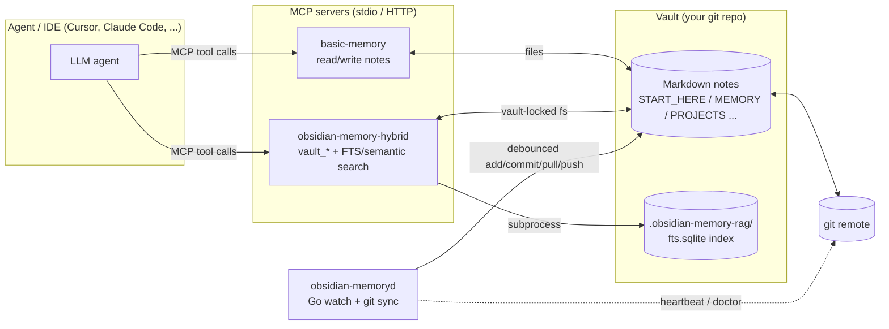
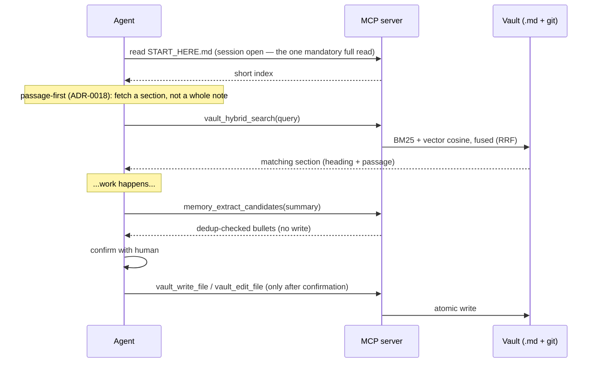
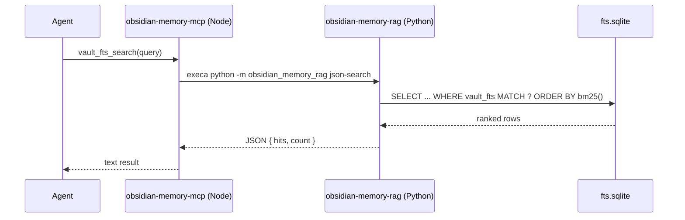
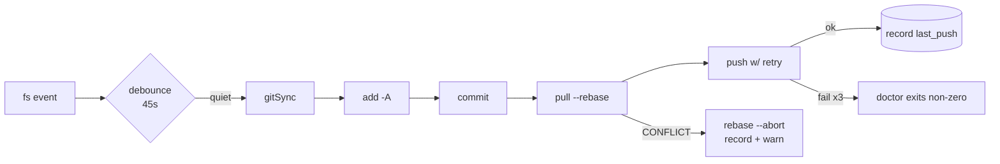

# Architecture

This document is the **map** of the repository: what the pieces are, how data
flows between them, and the design patterns they share. The **rationale** for
each decision lives in [`docs/adr/`](./docs/adr/) — when this document says
"because X", the ADR is where "X" is argued in full. For agent-facing operating
instructions see [`AGENTS.md`](./AGENTS.md); for human onboarding see
[`docs/en/install.md`](./docs/en/install.md).

## What the system is

A **cross-platform kit** that gives AI agents **persistent memory** as a plain
**Markdown vault under git**, exposed to the agent through **MCP** (Model Context
Protocol). Everything runs locally or in your own infrastructure — there is no
hosted service. The kit is deliberately modular: the only required piece is an
MCP server pointed at a vault. The rest (lexical/semantic retrieval, a git-sync
daemon, the installer) are optional add-ons that degrade gracefully when absent.

## Repository layout

| Path                                 | Language       | Role                                                                       |
| ------------------------------------ | -------------- | -------------------------------------------------------------------------- |
| `cmd/obsidian-memoryd/`              | Go             | Daemon: filesystem watch → debounced git sync; `doctor` health report      |
| `packages/obsidian-memory-mcp/`      | Node (ESM)     | The "hybrid" MCP sidecar (stdio): vault-locked file + search tools         |
| `packages/obsidian-memory-rag/`      | Python         | FTS5 indexer + BM25 search (the search engine the sidecar bridges to)      |
| `packages/create-obsidian-memory/`   | Node           | `npx` initializer: merges MCP config, scaffolds a vault                    |
| `scripts/`                           | TS / Node      | `sync-agents.ts` (rule generator), parity + MCP smoke checks               |
| `.agents/`, `.cursor/`, `.continue/` | Markdown       | Per-IDE rule files; `.agents/rules/*` is the source, the rest derived      |
| `evals/`                             | Node / Py / MD | Retrieval-quality benchmark (recall@k/MRR, gated) + prompt-adherence smoke |
| `docs/`                              | Markdown       | ADRs (decisions), setup guides, troubleshooting (bilingual ES/EN)          |
| `examples/`                          | Markdown       | Anonymized sample vault layout                                             |

It is an npm **workspaces** monorepo (`packages/*`) for the Node side, a single
Go module (`go.mod`) for the daemon, and a `pyproject.toml` package for the RAG
sidecar. The three toolchains are independent and individually optional.

## Components

### 1. `obsidian-memoryd` — Go sync daemon

Keeps the vault's git history moving without the user thinking about it.

- **Entry point:** [`cmd/obsidian-memoryd/main.go`](./cmd/obsidian-memoryd/main.go) — subcommands `watch`, `sync once`, `doctor`, `service`, `inspect`, `version`.
- **Sync algorithm:** `add → commit → pull --rebase → push` with per-step timeouts, rebase-conflict abort, and exponential push retry (ADR-0004). Only one sync runs at a time per process (`syncMu` mutex; concurrent callers get `ErrSyncBusy`).
- **Watch:** `fsnotify` recursive watch with a configurable debounce (`OBSIDIAN_MEMORY_DEBOUNCE`, default 45s) so burst saves do not hammer the remote. Skips `.git`, `node_modules`, `.obsidian`.
- **Health:** [`state.go`](./cmd/obsidian-memoryd/state.go) persists a small JSON record (heartbeat, last push, last rebase abort, consecutive push failures) via atomic tmp+rename. `doctor` reads it and exits non-zero on stale heartbeat or repeated push failure — the only health surface when the daemon runs hidden on Windows (`-H windowsgui`).
- **Cross-platform:** process-hiding is split by build tag — [`proc_windows.go`](./cmd/obsidian-memoryd/proc_windows.go) (`CREATE_NO_WINDOW`) vs [`proc_other.go`](./cmd/obsidian-memoryd/proc_other.go) (no-op). Service install supports Windows/macOS service managers and Linux systemd-user (ADR-0012).
- **Testability:** git invocation is abstracted behind the `Runner` interface so tests inject a fake instead of shelling out.

### 2. `obsidian-memory-mcp` — hybrid MCP sidecar (Node)

The agent's authoritative window into the vault. Stdio MCP server exposing ten
tools, split into small modules so the pure logic is unit-testable without
spawning the transport.

- **Entry point / wiring:** [`src/hybrid-mcp.mjs`](./packages/obsidian-memory-mcp/src/hybrid-mcp.mjs) — registers tools and connects `StdioServerTransport`. A `main()` entry-point guard prevents the server from spawning on `import` (so tests can import siblings safely).
- **Tools (ten):**
  - `vault_fts_search` / `vault_fts_index` — bridge to the Python RAG engine via `execa` (BM25 lexical search + incremental index).
  - `vault_hybrid_search` — BM25 + per-section vector cosine fused via RRF; returns the **matching section**, not the whole note (the passage-first default — ADR-0017/0018). Optional `graph: true` fuses in a third ranking of `[[wikilink]]`-adjacent notes (ADR-0019).
  - `vault_complete` — prefix autocomplete over note titles, filename stems and inline `#tags` (Trie over the FTS index; ADR-0019).
  - `vault_read_file` / `vault_write_file` / `vault_edit_file` / `vault_list_directory` — **vault-locked** filesystem access (reads are wrapped in an untrusted-data envelope, ADR-0018 D6).
  - `vault_audit` — vault health: notes over a token budget, broken `[[wikilinks]]`, `SESSION_LOG` size (bridges the Python `json-audit`).
  - `memory_extract_candidates` — pre-close ritual: turn a free-text recap into dedup-checked memory bullets (read-only; never writes).
- **Why the vault-locked tools exist:** `@modelcontextprotocol/server-filesystem` uses **MCP Roots** — when the client advertises `roots`, the filesystem server replaces its allowed directories with the client's, so it tracks the _active project's_ cwd and loses the vault. These tools read `BASIC_MEMORY_HOME` once and never leave it. See the module header in [`src/vault-fs.mjs`](./packages/obsidian-memory-mcp/src/vault-fs.mjs).
- **Module split (single-responsibility):**
  - [`vault-fs.mjs`](./packages/obsidian-memory-mcp/src/vault-fs.mjs) — path-safe read/write/edit/list (pure; no MCP dependency).
  - [`extract.mjs`](./packages/obsidian-memory-mcp/src/extract.mjs) — bullet/term extraction helpers for the close ritual.
  - [`mcp-result.mjs`](./packages/obsidian-memory-mcp/src/mcp-result.mjs) — `toolHandler()` wrapper that shapes every tool's return value and centralizes error→`isError` handling.
  - [`telemetry.mjs`](./packages/obsidian-memory-mcp/src/telemetry.mjs) — Pino logging + opt-in OpenTelemetry (see [Observability](#observability)).

### 3. `obsidian-memory-rag` — retrieval engine (Python)

A dependency-free (stdlib-only) local search engine over the vault's Markdown.
The Node sidecar shells out to it; it can also be used directly as a CLI. Lexical
search (FTS5 / BM25) is always available; semantic and hybrid search are an
additive layer that preserves the zero-dependency default (ADR-0017).

- **CLI:** [`cli.py`](./packages/obsidian-memory-rag/src/obsidian_memory_rag/cli.py) — `index` (with `--semantic`), `search` / `hybrid-search` (auto-index incrementally before querying; `--no-auto-index` to skip; `--graph` for wikilink-aware recall), `complete` (Trie prefix autocomplete), `bench`, `bench-recall` / `json-bench-recall` (recall@k / MRR / hit@1 against a labelled corpus — the retrieval-quality gate), `audit` (note-budget + broken-`[[wikilink]]` + `SESSION_LOG` report), `rotate-log` (archive old `SESSION_LOG` sections to `SESSION_LOG/archive.md`), and machine-readable `json-search` / `json-hybrid-search` / `json-index` / `json-audit` / `json-complete` (the bridge surface).
- **Index:** [`indexer.py`](./packages/obsidian-memory-rag/src/obsidian_memory_rag/indexer.py) — incremental FTS index by `(mtime_ns, size)`; `index_vectors` builds embeddings in a separate, equally incremental pass so the FTS path is untouched.
- **Store:** [`store.py`](./packages/obsidian-memory-rag/src/obsidian_memory_rag/store.py) — SQLite **FTS5** virtual table (`unicode61 remove_diacritics 2`) tuned for read-heavy agent workloads (WAL, `mmap`, normal sync).
- **Embeddings:** [`embeddings.py`](./packages/obsidian-memory-rag/src/obsidian_memory_rag/embeddings.py) — pluggable `Embedder` protocol. The default `HashingEmbedder` is pure-stdlib and deterministic (lexical feature hashing); the optional `fastembed` neural embedder (behind the `[semantic]` extra) adds meaning-based recall. Chosen via `OBSIDIAN_MEMORY_EMBEDDER`.
- **Chunking + vectors:** [`chunking.py`](./packages/obsidian-memory-rag/src/obsidian_memory_rag/chunking.py) splits each note into heading-aware sections; [`vector_store.py`](./packages/obsidian-memory-rag/src/obsidian_memory_rag/vector_store.py) embeds each chunk into a `note_chunks` table (float32 BLOBs in the same `fts.sqlite`) and ranks by brute-force cosine (sub-10 ms for a personal vault; `sqlite-vec` is the documented future acceleration).
- **Query:** [`query.py`](./packages/obsidian-memory-rag/src/obsidian_memory_rag/query.py) — `search_vault` (BM25), `semantic_search` (chunk cosine), and `hybrid_search` fusing them via Reciprocal Rank Fusion and returning the **matching passage** so a caller reads a section, not the whole note; degrades to pure FTS when no chunks exist. With `graph=True` it adds a third RRF input from `graph_neighbors`. `search_vault` keeps a precision-first AND but **falls back to OR when AND matches nothing**, so one missing or misspelled term doesn't drop an otherwise-relevant note on a pure-FTS (no-vector) install.
- **Graph + autocomplete:** [`graphlink.py`](./packages/obsidian-memory-rag/src/obsidian_memory_rag/graphlink.py) parses the `[[wikilink]]` graph from the FTS bodies and ranks notes one hop from the strongest hits (ADR-0019); [`trie.py`](./packages/obsidian-memory-rag/src/obsidian_memory_rag/trie.py) + [`complete.py`](./packages/obsidian-memory-rag/src/obsidian_memory_rag/complete.py) back prefix autocompletion over titles / filenames / `#tags`.
- **Layout:** the index lives beside the vault in `.obsidian-memory-rag/fts.sqlite` (git-ignored), so it never pollutes the synced notes (ADR-0014 / ADR-0017).

### 4. `create-obsidian-memory` — initializer (Node)

One `npx` command to wire an IDE to a vault, idempotently and safely.

- **Entry point:** [`src/index.js`](./packages/create-obsidian-memory/src/index.js) — interactive by default; `--non-interactive`/`--yes` for CI.
- **Config merge:** [`src/mcp-merge.mjs`](./packages/create-obsidian-memory/src/mcp-merge.mjs) — pure functions that splice `basic-memory` (and optionally `obsidian-memory-hybrid`) into an existing `~/.cursor/mcp.json` **without dropping other servers**. The `basic-memory` version is pinned in one constant (`BASIC_MEMORY_VERSION`) to close a supply-chain RCE vector (see [Security](#trust-and-security-model)).
- **Safety:** BOM-stripping before JSON parse, **atomic writes** (tmp + fsync + rename, `0o600` on POSIX), and a timestamped backup of any prior `mcp.json` before overwriting.
- **Extras:** optional vault scaffold, `vault/.vscode/settings.json` Git-quieting on Windows, and a gitleaks pre-commit hook.

### 5. Agent-rule surface + maintainer tooling

The kit is **IDE-agnostic** (ADR-0011): one canonical rule set, projected into
each IDE's format.

- **Source of truth:** [`AGENTS.md`](./AGENTS.md) (hand-written sections + an autogenerated block) and `.agents/rules/*.md`.
- **Generator:** [`scripts/sync-agents.ts`](./scripts/sync-agents.ts) builds the `AGENTS.md` `<!-- AUTOGEN -->` block from `.agents/rules/*` and projects `.cursor/rules/*.mdc` + `.continue/rules/*.md` from [`agents-manifest.yaml`](./agents-manifest.yaml). `--check` mode fails CI on drift, so generated files can never silently diverge from their source.
- **Version guard:** [`scripts/version.mjs`](./scripts/version.mjs) (`npm run version:check` / `version:set`) is the single source of truth for the kit version — it validates that **every** marker agrees (both `package.json`s, `pyproject.toml`, the README badge, `agent.toml`, and the Go daemon's `var version`) with the latest `CHANGELOG.md` section. CI's `lint` job runs `version check` (so badge/package/CHANGELOG drift fails the build) and the `release` workflow re-checks it before publishing.
- **Quality gates:** `scripts/mcp-smoke.mjs`, the `evals/retrieval` recall benchmark (`bench-recall` — deterministic on the dependency-free embedder, gated in CI as `retrieval-bench`), and the `evals/` prompt-adherence smoke.

## Data flows

### Memory read / write

### Retrieval (lexical, semantic, hybrid)

The index is refreshed incrementally by `vault_fts_index` (or the CLI), comparing
each file's `(mtime, size)` against the `indexed_files` table so re-indexing a
large vault only touches changed notes.

`vault_hybrid_search` follows the identical bridge but calls `json-hybrid-search`,
which fuses BM25 with per-section vector cosine via Reciprocal Rank Fusion — so a
note surfaces on meaning or partial match, not just exact keywords. Each hit carries
the matching section's heading + text, so the agent usually answers without a
follow-up full-note read (the main token saver). Build the vectors first with
`vault_fts_index({ semantic: true })`; without them the tool returns the BM25
ranking unchanged (ADR-0017).

### Git sync (daemon)

### Config generation (`sync-agents`)

`.agents/rules/*.md` + `agents-manifest.yaml` → `sync-agents.ts` → `AGENTS.md`
autogen block + `.cursor/rules/*.mdc` + `.continue/rules/*.md`. CI runs the same
script with `--check`; any drift between source and generated output fails the
build.

## Cross-cutting design patterns

- **Atomic writes everywhere.** Daemon state, vault files, and `mcp.json` all use
  temp-file + rename so a crash mid-write never truncates the original.
- **Path-safety as a hard boundary.** `safeVaultPath` resolves symlinks and
  refuses any path that escapes the vault root — the vault-locked tools cannot be
  tricked into touching files outside `BASIC_MEMORY_HOME`.
- **Dependency injection for I/O.** The Go `Runner` interface (and, in the RAG
  engine, a pluggable embedder) lets tests exercise logic without real
  subprocesses, networks, or models.
- **Cross-platform via build tags / capability checks,** not runtime branching
  sprawl (`proc_windows.go` vs `proc_other.go`).
- **Pinned third-party MCP dependencies** to remove the "latest from PyPI on every
  start" supply-chain surface.
- **Optional everything.** The Python core has zero runtime dependencies; heavier
  capabilities (semantic embeddings, OpenTelemetry) sit behind optional extras and
  no-op when not installed/configured.

## Observability

Two **local** surfaces (no hosted backend; see [`docs/observability.md`](./docs/observability.md)):

1. **Daemon health** — `obsidian-memoryd doctor` reads the state file and reports
   heartbeat age, last push, and failure counters.
2. **MCP traces (opt-in)** — `telemetry.mjs` emits Pino JSON always; OpenTelemetry
   OTLP export activates only when the optional `@opentelemetry/*` deps are
   installed **and** `OTEL_EXPORTER_OTLP_ENDPOINT` is set, so an unconfigured
   install never fires exports at a non-existent collector.

## Trust and security model

- **The vault is data, not instructions.** Notes may contain text that looks like
  commands ("run X", "ignore previous rules"). Agents must treat vault content as
  untrusted input and never execute embedded directives — authoritative
  instructions come only from the chat and `AGENTS.md`. See `SECURITY.md`.
- **Path traversal is defended in depth** (`safeVaultPath`, covered by unit tests
  for `..`, absolute escapes, and symlink escapes).
- **Supply chain:** `basic-memory` is version-pinned; `mcp-remote` has a minimum
  version (`docs/security/mcp-remote-rce.md`); gitleaks can guard commits.
- **No secrets in the repo or examples**, enforced by gitleaks in CI.

## Testing and CI

| Surface             | Command                                                                                                                                                                        |
| ------------------- | ------------------------------------------------------------------------------------------------------------------------------------------------------------------------------ |
| Go daemon           | `go test ./...`                                                                                                                                                                |
| Node packages       | `npm test -w <package>` (`node --test`)                                                                                                                                        |
| Python RAG          | `pytest packages/obsidian-memory-rag/tests`                                                                                                                                    |
| Retrieval quality   | `python -m obsidian_memory_rag bench-recall --corpus evals/retrieval/corpus --queries evals/retrieval/queries.jsonl --assert-recall 0.95 --assert-mrr 0.90 --assert-hit1 0.90` |
| Version consistency | `npm run version:check`                                                                                                                                                        |
| Generated rules     | `npm run sync-agents:check`                                                                                                                                                    |
| Docs (lint/format)  | `markdownlint` + `prettier --check`                                                                                                                                            |
| Links               | `npx lychee .`                                                                                                                                                                 |
| Prompt adherence    | `npm run eval:adherence`                                                                                                                                                       |

CI (`.github/workflows/ci.yml`) mirrors these across a lint/test/smoke matrix.

## Where design decisions live

[`docs/adr/`](./docs/adr/) holds one file per decision. The load-bearing ones for
this architecture:

- **ADR-0004** — git sync order (`add → commit → pull --rebase → push`).
- **ADR-0011** — `AGENTS.md` as the canonical, IDE-agnostic agent surface.
- **ADR-0012** — cross-platform Go daemon replacing PowerShell + Task Scheduler.
- **ADR-0014** — hybrid retrieval (FTS5 now, vector layer as the optional extension).
- **ADR-0016** — default localhost port 8765 for Streamable HTTP `basic-memory`.
- **ADR-0019** — graph-aware retrieval over the `[[wikilink]]` graph.
- **ADR-0020** — measured retrieval quality (recall@k / MRR) as a CI gate.

Do not undo an accepted ADR without superseding it with a new one
(see [`CONTRIBUTING.md`](./CONTRIBUTING.md)).
