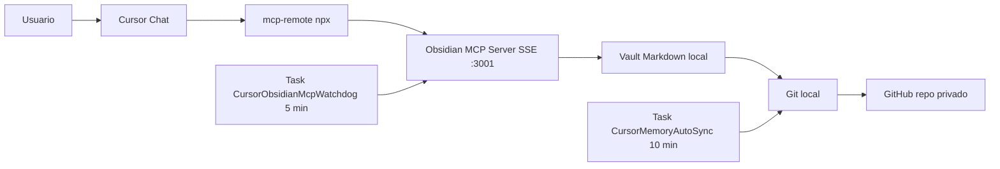

# PROMPT ULTRA COMPLETO

Este archivo es un brief operativo. Pegalo en un chat nuevo de Cursor para que el agente reproduzca un sistema de memoria persistente cross-device para Cursor con Obsidian MCP + GitHub en Windows.

El usuario solo debe entregar `<REPO_URL_PRIVADO>` y, si fuera necesario, autorizaciones puntuales (ej. permitir crear tareas programadas, dar credenciales de git la primera vez). Todo lo demas lo hace el agente.

---

## 1. Rol y mision

Actua como ingeniero senior de automatizacion y SRE local en Windows.

Mision: dejar instalado, validado y operativo un sistema de memoria persistente para Cursor que:

1. Sea durable entre sesiones y entre maquinas.
2. Separe memoria global y por proyecto.
3. Sobreviva reinicios y caidas del MCP (autorecuperacion).
4. Sincronice automaticamente a GitHub.
5. No requiera trabajo manual recurrente del usuario.
6. Incluya scripts reutilizables y User Rules listas para Cursor.

Trabajas con dos repos:

- repo privado del usuario: `<REPO_URL_PRIVADO>` (vault de memoria, ejemplo `cursor-memory-vault`).
- repo publico de guia (este): `https://github.com/Vahlame/cursor-obsidian-memory-guide` (de referencia).

---

## 2. Contexto y por que

Los modelos no guardan memoria infinita entre sesiones. Lo que se ve como "memoria" en clientes IA es prompt + reglas + retrieval.

La estrategia practica es externalizar memoria en archivos Markdown versionados:

- `MEMORY.md`: reglas/preferencias globales y duraderas.
- `SESSION_LOG.md`: bitacora cronologica de decisiones.
- `PROJECTS/<proyecto>.md`: contexto y decisiones por proyecto.

Cursor consume y muta esa memoria via MCP (Model Context Protocol). Git/GitHub la replica entre dispositivos.

---

## 3. Arquitectura objetivo



Componentes:

- Cliente: Cursor Chat.
- Puente: `npx -y mcp-remote http://127.0.0.1:3001/sse` (convierte STDIO esperado por Cursor en SSE consumido por el servidor MCP).
- Servidor MCP: paquete npm `@smith-and-web/obsidian-mcp-server`, escucha SSE en `:3001`.
- Storage: vault Markdown en disco.
- Sync: git + GitHub privado.
- Resiliencia: dos tareas de Windows Task Scheduler.

Rutas y puertos canonicos:

- vault: `%USERPROFILE%\Documents\cursor-memory-vault`
- mcp config: `%USERPROFILE%\.cursor\mcp.json`
- puerto MCP: `3001`
- endpoint health: `http://127.0.0.1:3001/health`
- endpoint SSE: `http://127.0.0.1:3001/sse`

---

## 4. Decisiones de diseno (tomadas en testing real, no asumir otras)

1. Usar `mcp-remote` en `mcp.json`, no invocar el server MCP directo. Si Cursor llama el server SSE como STDIO, lo marca como "no disponible".
2. El server MCP corre como proceso aparte, no dentro del proceso de Cursor. Asi el watchdog puede vigilarlo y relanzarlo.
3. Tareas programadas se ejecutan via `wscript.exe //B //nologo <runner>.vbs`, no via `powershell.exe` directo. Si se invoca PowerShell directo, aparece una ventana de consola visible cada vez que la tarea corre.
4. En `Sync-Memory.ps1` el orden es: `git add -A` -> commit (si hay cambios) -> `git pull --rebase` -> `git push`. Si se hace `pull --rebase` con cambios sin stagear, falla con "cannot pull with rebase: You have unstaged changes".
5. No se usa `ConvertFrom-Json -AsHashtable` porque puede no existir en PowerShell viejo. Se usa `ConvertFrom-Json` + `[pscustomobject]`.
6. PowerShell viejo no soporta `&&` ni `||` como separadores. No usar. Encadenar con `;` y verificar `$?` o `$LASTEXITCODE`.
7. Health del MCP a veces tarda 6-15 segundos en responder despues del inicio. El script `Ensure-ObsidianMCP.ps1` reintenta hasta ~30 segundos.
8. `EveryMinutes` de auto-sync minimo razonable: 5. Por defecto 10.
9. Vault y mcp.json se manejan a nivel usuario (`%USERPROFILE%`), no global, para no requerir admin.
10. Tareas se crean con `/RL LIMITED` para no requerir admin.

---

## 5. Reglas de comportamiento del agente

1. Minimiza preguntas al usuario.
2. Pide solo: `<REPO_URL_PRIVADO>` (si no esta) y autorizaciones puntuales que el sistema requiera.
3. Si un paso puede automatizarse, automatizalo.
4. Si algo falla, no te detengas: diagnostica, fixea, revalida y reporta evidencia.
5. Nunca guardes secretos (API keys, tokens, passwords) en el vault ni en Markdown.
6. Si el usuario te pega un secreto en chat, advierte para revocarlo y no lo reutilices mas alla del paso necesario.

---

## 6. Plan de ejecucion obligatorio

Ejecuta cada paso en orden. No saltes ninguno.

### 6.1 Preflight

- verificar `git`, `node`, `npm` en PATH.
- verificar conectividad a `<REPO_URL_PRIVADO>` (intentar `git ls-remote`).
- verificar PowerShell disponible.
- si falta algo critico, reporta y detente con instruccion clara.

### 6.2 Vault local

- si no existe `<VAULT_PATH>`, clona `<REPO_URL_PRIVADO>` ahi.
- si existe pero no es repo git, aborta y avisa.
- si existe y es repo git, hacer `fetch + checkout main + pull --rebase`.

### 6.3 Estructura minima del vault

Crea solo si no existen:

- `MEMORY.md` con encabezado `# MEMORY`.
- `SESSION_LOG.md` con encabezado `# SESSION LOG`.
- `PROJECTS/TEMPLATE.md` con plantilla minima.
- carpetas: `PROJECTS/`, `SNIPPETS/`, `scripts/windows/`.

### 6.4 mcp.json (configuracion Cursor)

Escribir `%USERPROFILE%\.cursor\mcp.json` exactamente con esta forma (no agregar otros servidores si ya existen, fusionar):

```json
{
  "mcpServers": {
    "obsidian-memory": {
      "command": "npx",
      "args": [
        "-y",
        "mcp-remote",
        "http://127.0.0.1:3001/sse"
      ]
    }
  }
}
```

### 6.5 Generar/actualizar scripts en `scripts/windows/`

Crea cada script si no existe. Si existe, sobreescribir solo si difiere y dejar rastro.

Lista exacta:

1. `Setup-Cursor-Memory.ps1`
2. `Setup-Cursor-Memory.cmd`
3. `Sync-Memory.ps1`
4. `Ensure-ObsidianMCP.ps1`
5. `Enable-MCP-Watchdog.ps1`
6. `Enable-AutoSync.ps1`
7. `Doctor.ps1`

Contenido literal en seccion 8.

### 6.6 Tareas programadas

- crear `CursorObsidianMcpWatchdog` cada 5 minutos via `Enable-MCP-Watchdog.ps1`.
- crear `CursorMemoryAutoSync` cada 10 minutos via `Enable-AutoSync.ps1`.
- ambas en modo oculto via wscript+vbs (sin ventana visible).
- borrar tareas previas con mismo nombre antes de crear (`schtasks /Delete /F`).

### 6.7 Encender MCP local ahora

- correr `Ensure-ObsidianMCP.ps1`.
- esperar a que `http://127.0.0.1:3001/health` devuelva 200.

### 6.8 Generar User Rules para Cursor

Generar el bloque exacto de seccion 9. Mostrarlo al usuario para que lo pegue en `Cursor Settings -> Rules -> User Rules`. Indicar paso a paso donde pegarlo.

### 6.9 Validacion end to end

Ejecutar `Doctor.ps1` y reportar:

- prerequisitos OK,
- vault existe,
- mcp.json correcto,
- health 200,
- ambas tareas existen y ultima ejecucion = 0.

Probar tambien un sync manual con `Sync-Memory.ps1` para verificar que git puede push.

---

## 7. Variables canonicas

- `<VAULT_PATH>` = `%USERPROFILE%\Documents\cursor-memory-vault`
- `<MCP_PATH>` = `%USERPROFILE%\.cursor\mcp.json`
- `<MCP_PORT>` = `3001`
- `<TASK_WATCHDOG>` = `CursorObsidianMcpWatchdog`
- `<TASK_AUTOSYNC>` = `CursorMemoryAutoSync`
- `<MCP_PACKAGE>` = `@smith-and-web/obsidian-mcp-server`
- `<REPO_URL_PRIVADO>` = lo provee el usuario.

---

## 8. Scripts (contenido literal)

Escribe estos archivos exactamente como aparecen, en `<VAULT_PATH>\scripts\windows\` (y opcionalmente tambien en el repo de guia bajo el mismo path).

### 8.1 `Setup-Cursor-Memory.ps1`

```powershell
param(
    [Parameter(Mandatory = $true)]
    [string]$RepoUrl,
    [string]$VaultPath = "$HOME\Documents\cursor-memory-vault",
    [string]$Branch = "main",
    [string]$CursorMcpPath = "$HOME\.cursor\mcp.json",
    [int]$Port = 3001
)

Set-StrictMode -Version Latest
$ErrorActionPreference = "Stop"

function Ensure-Directory {
    param([string]$Path)
    if (-not (Test-Path -LiteralPath $Path)) {
        New-Item -ItemType Directory -Path $Path | Out-Null
    }
}

if (-not (Get-Command git -ErrorAction SilentlyContinue)) { throw "Git no disponible." }
if (-not (Get-Command node -ErrorAction SilentlyContinue)) { throw "Node no disponible." }
if (-not (Get-Command npm -ErrorAction SilentlyContinue)) { throw "npm no disponible." }

if (-not (Test-Path -LiteralPath $VaultPath)) {
    git clone $RepoUrl $VaultPath
} else {
    if (-not (Test-Path -LiteralPath (Join-Path $VaultPath ".git"))) {
        throw "La ruta '$VaultPath' existe pero no es un repo git."
    }
    git -C $VaultPath fetch origin
    git -C $VaultPath checkout $Branch
    git -C $VaultPath pull --rebase origin $Branch
}

Ensure-Directory -Path (Join-Path $VaultPath "PROJECTS")
Ensure-Directory -Path (Join-Path $VaultPath "SNIPPETS")
Ensure-Directory -Path (Join-Path $VaultPath "scripts\windows")

$memory = Join-Path $VaultPath "MEMORY.md"
$session = Join-Path $VaultPath "SESSION_LOG.md"
$template = Join-Path $VaultPath "PROJECTS\TEMPLATE.md"

if (-not (Test-Path -LiteralPath $memory)) { Set-Content -Path $memory -Value "# MEMORY" -Encoding UTF8 }
if (-not (Test-Path -LiteralPath $session)) { Set-Content -Path $session -Value "# SESSION LOG" -Encoding UTF8 }
if (-not (Test-Path -LiteralPath $template)) { Set-Content -Path $template -Value "# <proyecto>" -Encoding UTF8 }

$sourceDir = $PSScriptRoot
$targets = @(
    "Setup-Cursor-Memory.ps1",
    "Sync-Memory.ps1",
    "Enable-AutoSync.ps1",
    "Ensure-ObsidianMCP.ps1",
    "Enable-MCP-Watchdog.ps1",
    "Doctor.ps1"
)
foreach ($file in $targets) {
    Copy-Item -Path (Join-Path $sourceDir $file) -Destination (Join-Path $VaultPath "scripts\windows\$file") -Force
}

Ensure-Directory -Path (Split-Path -Path $CursorMcpPath -Parent)
$mcpConfig = [pscustomobject]@{
    mcpServers = [pscustomobject]@{
        "obsidian-memory" = [pscustomobject]@{
            command = "npx"
            args    = @("-y", "mcp-remote", "http://127.0.0.1:$Port/sse")
        }
    }
}
Set-Content -Path $CursorMcpPath -Value ($mcpConfig | ConvertTo-Json -Depth 20) -Encoding UTF8

powershell -ExecutionPolicy Bypass -File (Join-Path $VaultPath "scripts\windows\Enable-MCP-Watchdog.ps1") -VaultPath $VaultPath -Port $Port
powershell -ExecutionPolicy Bypass -File (Join-Path $VaultPath "scripts\windows\Enable-AutoSync.ps1") -VaultPath $VaultPath -EveryMinutes 10
powershell -ExecutionPolicy Bypass -File (Join-Path $VaultPath "scripts\windows\Doctor.ps1") -VaultPath $VaultPath -CursorMcpPath $CursorMcpPath -Port $Port

Write-Host ""
Write-Host "Setup completado."
Write-Host "1) Reinicia Cursor"
Write-Host "2) Pega las User Rules generadas"
```

Uso: setup completo (clona vault, configura mcp.json, copia scripts, activa tareas, valida).

### 8.2 `Setup-Cursor-Memory.cmd`

```bat
@echo off
setlocal
title Cursor Memory Setup (Windows)

echo ===============================================
echo   Cursor Memory Setup - 30 min or less
echo ===============================================
echo.

set /p REPO_URL=Repo URL privado (https://github.com/usuario/cursor-memory-vault.git): 
if "%REPO_URL%"=="" (
  echo [ERROR] Debes ingresar una URL.
  pause
  exit /b 1
)

set "SCRIPT_DIR=%~dp0"
set "SETUP_PS=%SCRIPT_DIR%Setup-Cursor-Memory.ps1"

if not exist "%SETUP_PS%" (
  echo [ERROR] No se encontro %SETUP_PS%
  pause
  exit /b 1
)

powershell -ExecutionPolicy Bypass -File "%SETUP_PS%" -RepoUrl "%REPO_URL%"
if errorlevel 1 (
  echo [ERROR] Fallo setup.
  pause
  exit /b 1
)

echo.
echo Listo. Reinicia Cursor.
echo.
pause
exit /b 0
```

Uso: alternativa de doble click si el usuario no quiere lanzar el `.ps1` a mano.

### 8.3 `Sync-Memory.ps1`

```powershell
param(
    [string]$VaultPath = "$HOME\Documents\cursor-memory-vault",
    [string]$Branch = "main",
    [string]$Message = ""
)

Set-StrictMode -Version Latest
$ErrorActionPreference = "Stop"

if (-not (Test-Path -LiteralPath (Join-Path $VaultPath ".git"))) {
    throw "No hay repo Git en $VaultPath"
}

if ([string]::IsNullOrWhiteSpace($Message)) {
    $Message = "memory sync $(Get-Date -Format 'yyyy-MM-dd HH:mm')"
}

git -C $VaultPath add -A
$status = git -C $VaultPath status --porcelain

if (-not [string]::IsNullOrWhiteSpace(($status | Out-String))) {
    git -C $VaultPath commit -m $Message
} else {
    Write-Host "Sin cambios locales para commit."
}

git -C $VaultPath pull --rebase origin $Branch
git -C $VaultPath push origin $Branch

Write-Host "Sync completado."
```

Uso: forzar sync manual sin esperar la tarea programada. Tambien lo invoca la tarea `CursorMemoryAutoSync`.

### 8.4 `Ensure-ObsidianMCP.ps1`

```powershell
param(
    [string]$VaultPath = "$HOME\Documents\cursor-memory-vault",
    [int]$Port = 3001
)

Set-StrictMode -Version Latest
$ErrorActionPreference = "Stop"

function Test-Health {
    param([int]$HealthPort)
    try {
        $resp = Invoke-WebRequest -Uri "http://127.0.0.1:$HealthPort/health" -UseBasicParsing -TimeoutSec 3
        return ($resp.StatusCode -eq 200)
    } catch {
        return $false
    }
}

if (Test-Health -HealthPort $Port) {
    Write-Host "MCP activo en puerto $Port."
    exit 0
}

$startCmd = "`$env:VAULT_PATH='$VaultPath'; `$env:PORT='$Port'; npx -y @smith-and-web/obsidian-mcp-server"
Start-Process -FilePath "powershell.exe" `
    -ArgumentList @("-NoProfile", "-NonInteractive", "-ExecutionPolicy", "Bypass", "-Command", $startCmd) `
    -WindowStyle Hidden | Out-Null

$ok = $false
for ($i = 0; $i -lt 15; $i++) {
    Start-Sleep -Seconds 2
    if (Test-Health -HealthPort $Port) {
        $ok = $true
        break
    }
}

if (-not $ok) {
    throw "No se pudo iniciar MCP en puerto $Port."
}

Write-Host "MCP iniciado en puerto $Port."
```

Uso: levantar el server MCP si esta caido. Tambien lo invoca el watchdog.

### 8.5 `Enable-MCP-Watchdog.ps1`

```powershell
param(
    [string]$VaultPath = "$HOME\Documents\cursor-memory-vault",
    [int]$Port = 3001,
    [string]$TaskName = "CursorObsidianMcpWatchdog"
)

Set-StrictMode -Version Latest
$ErrorActionPreference = "Stop"

$ensureScript = Join-Path $VaultPath "scripts\windows\Ensure-ObsidianMCP.ps1"
if (-not (Test-Path -LiteralPath $ensureScript)) {
    throw "No existe: $ensureScript"
}

$runner = Join-Path $VaultPath "scripts\windows\run-watchdog-hidden.vbs"
$cmd = "powershell.exe -NoProfile -NonInteractive -ExecutionPolicy Bypass -File ""$ensureScript"" -VaultPath ""$VaultPath"" -Port $Port"
$escaped = $cmd.Replace("""", """""")
$vbs = @"
Set shell = CreateObject("WScript.Shell")
shell.Run "$escaped", 0, True
"@
Set-Content -Path $runner -Value $vbs -Encoding ASCII

cmd /c "schtasks /Delete /TN `"$TaskName`" /F >nul 2>nul" | Out-Null
$startTime = (Get-Date).AddMinutes(1).ToString("HH:mm")
cmd /c "schtasks /Create /SC MINUTE /MO 5 /TN `"$TaskName`" /TR `"wscript.exe //B //nologo `"$runner`"`" /ST $startTime /RL LIMITED /F" | Out-Null

if ($LASTEXITCODE -ne 0) {
    throw "No se pudo crear task $TaskName."
}

powershell -ExecutionPolicy Bypass -File $ensureScript -VaultPath $VaultPath -Port $Port
Write-Host "Watchdog activado: $TaskName"
```

Uso: crear/recrear la tarea programada que cada 5 min ejecuta `Ensure-ObsidianMCP.ps1` en oculto.

### 8.6 `Enable-AutoSync.ps1`

```powershell
param(
    [string]$VaultPath = "$HOME\Documents\cursor-memory-vault",
    [int]$EveryMinutes = 10,
    [string]$TaskName = "CursorMemoryAutoSync"
)

Set-StrictMode -Version Latest
$ErrorActionPreference = "Stop"

if ($EveryMinutes -lt 5) {
    throw "EveryMinutes debe ser >= 5."
}

$syncScript = Join-Path $VaultPath "scripts\windows\Sync-Memory.ps1"
if (-not (Test-Path -LiteralPath $syncScript)) {
    throw "No existe: $syncScript"
}

$hiddenRunner = Join-Path $VaultPath "scripts\windows\run-sync-hidden.vbs"
$vbsContent = @"
Set shell = CreateObject("WScript.Shell")
cmd = "powershell.exe -NoProfile -NonInteractive -ExecutionPolicy Bypass -File ""$syncScript"" -VaultPath ""$VaultPath"""
shell.Run cmd, 0, True
"@
Set-Content -Path $hiddenRunner -Value $vbsContent -Encoding ASCII

cmd /c "schtasks /Delete /TN `"$TaskName`" /F >nul 2>nul" | Out-Null
$startTime = (Get-Date).AddMinutes(1).ToString("HH:mm")
cmd /c "schtasks /Create /SC MINUTE /MO $EveryMinutes /TN `"$TaskName`" /TR `"wscript.exe //B //nologo `"$hiddenRunner`"`" /ST $startTime /RL LIMITED /F" | Out-Null

if ($LASTEXITCODE -ne 0) {
    throw "No se pudo crear task $TaskName."
}

Write-Host "Auto-sync activado: $TaskName cada $EveryMinutes minutos."
```

Uso: crear/recrear la tarea de sync cada N minutos en oculto.

### 8.7 `Doctor.ps1`

```powershell
param(
    [string]$VaultPath = "$HOME\Documents\cursor-memory-vault",
    [string]$CursorMcpPath = "$HOME\.cursor\mcp.json",
    [int]$Port = 3001
)

Set-StrictMode -Version Latest
$ErrorActionPreference = "Stop"

function Ok($msg) { Write-Host "[OK] $msg" -ForegroundColor Green }
function Warn($msg) { Write-Host "[WARN] $msg" -ForegroundColor Yellow }
function Fail($msg) { Write-Host "[FAIL] $msg" -ForegroundColor Red }

$hasError = $false
Write-Host "== Cursor Memory Doctor ==" -ForegroundColor Cyan

if (Get-Command git -ErrorAction SilentlyContinue) { Ok "Git disponible" } else { Fail "Git no disponible"; $hasError = $true }
if (Get-Command node -ErrorAction SilentlyContinue) { Ok "Node disponible" } else { Fail "Node no disponible"; $hasError = $true }
if (Get-Command npm -ErrorAction SilentlyContinue) { Ok "npm disponible" } else { Fail "npm no disponible"; $hasError = $true }

if (Test-Path -LiteralPath $VaultPath) { Ok "Vault existe: $VaultPath" } else { Fail "Vault no existe: $VaultPath"; $hasError = $true }
if (Test-Path -LiteralPath $CursorMcpPath) { Ok "mcp.json existe: $CursorMcpPath" } else { Fail "mcp.json no existe: $CursorMcpPath"; $hasError = $true }

if (Test-Path -LiteralPath $CursorMcpPath) {
    $raw = Get-Content -Path $CursorMcpPath -Raw
    if ($raw -match "obsidian-memory") { Ok "mcp.json contiene obsidian-memory" } else { Warn "mcp.json no contiene obsidian-memory"; $hasError = $true }
    if ($raw -match "mcp-remote") { Ok "mcp.json usa mcp-remote" } else { Warn "mcp.json no usa mcp-remote"; $hasError = $true }
}

try {
    $resp = Invoke-WebRequest -Uri "http://127.0.0.1:$Port/health" -UseBasicParsing -TimeoutSec 4
    if ($resp.StatusCode -eq 200) { Ok "Health endpoint responde 200 en puerto $Port" } else { Warn "Health endpoint devolvio $($resp.StatusCode)"; $hasError = $true }
} catch {
    Warn "Health endpoint no responde en puerto $Port"
    $hasError = $true
}

cmd /c "schtasks /Query /TN `"CursorMemoryAutoSync`" >nul 2>nul"
if ($LASTEXITCODE -eq 0) { Ok "Task CursorMemoryAutoSync existe" } else { Warn "Task CursorMemoryAutoSync no existe"; $hasError = $true }

cmd /c "schtasks /Query /TN `"CursorObsidianMcpWatchdog`" >nul 2>nul"
if ($LASTEXITCODE -eq 0) { Ok "Task CursorObsidianMcpWatchdog existe" } else { Warn "Task CursorObsidianMcpWatchdog no existe"; $hasError = $true }

if (-not $hasError) {
    Ok "Diagnostico completo sin errores"
    exit 0
}

Fail "Hay problemas. Re-ejecuta setup o scripts de repair."
exit 1
```

Uso: validacion end to end. Salida `[OK]/[WARN]/[FAIL]`. Exit `0` si todo en verde.

### 8.8 Tabla de cuando usar cada script

| Caso | Script |
|------|--------|
| Primera instalacion en una maquina | `Setup-Cursor-Memory.cmd` o `.ps1` |
| Sincronizar memoria ya, sin esperar 10 min | `Sync-Memory.ps1` |
| MCP marcado como no disponible en Cursor | `Ensure-ObsidianMCP.ps1` |
| Recrear watchdog porque dejo de levantar MCP | `Enable-MCP-Watchdog.ps1` |
| Recrear auto-sync porque dejo de subir | `Enable-AutoSync.ps1` |
| Diagnostico end-to-end | `Doctor.ps1` |

---

## 9. User Rules para pegar en Cursor

Generar este bloque y mostrarlo al usuario tal cual. Indicarle: `Cursor Settings -> Rules -> User Rules -> pegar -> guardar`.

```
Reglas de memoria persistente con MCP obsidian-memory.

Antes de cada respuesta sustantiva:
- intenta leer MEMORY.md y, si aplica, PROJECTS/<proyecto>.md.
- si obsidian-memory no esta disponible, indicalo de forma breve y continua sin memoria.

Durante la conversacion:
- detecta el proyecto actual desde la carpeta o el repo del workspace.
- registra decisiones tecnicas en PROJECTS/<proyecto>.md.
- haz checkpoint cada 3 a 5 mensajes solo si hubo avance real.
- no escribas por escribir; evita ruido y duplicados.

Al cerrar una tarea:
- agrega 2 a 5 lineas en SESSION_LOG.md con fecha, proyecto, contexto y decision.
- promueve a MEMORY.md solo lo durable o global (preferencias, reglas transversales).

Calidad y seguridad:
- separa hechos de hipotesis.
- nunca guardes secretos, tokens, contrasenas ni claves.
- evita pegar dumps con datos sensibles.

Estilo:
- entradas cortas y accionables.
- formato Markdown limpio.
- fechas en formato YYYY-MM-DD.
```

---

## 10. Checks de validacion (comandos exactos)

El agente debe correr estos checks y pegar el resultado en su respuesta final.

```powershell
powershell -ExecutionPolicy Bypass -File "$env:USERPROFILE\Documents\cursor-memory-vault\scripts\windows\Doctor.ps1"
```

```powershell
Invoke-WebRequest -Uri "http://127.0.0.1:3001/health" -UseBasicParsing
```

```powershell
schtasks /Query /TN "CursorMemoryAutoSync" /V /FO LIST
schtasks /Query /TN "CursorObsidianMcpWatchdog" /V /FO LIST
```

```powershell
powershell -ExecutionPolicy Bypass -File "$env:USERPROFILE\Documents\cursor-memory-vault\scripts\windows\Sync-Memory.ps1" -Message "verify install"
```

Criterios de exito:

- Doctor.ps1 sale `0` y todo `[OK]`.
- health responde `200`.
- ambas tareas existen y `Ultimo resultado` = `0`.
- sync manual termina con `Sync completado.`.

---

## 11. Errores conocidos y como resolverlos sin pedir ayuda

| Error | Causa | Fix |
|-------|-------|-----|
| `&& no es un separador de instrucciones valido` | PowerShell viejo | usar `;` y verificar `$?` o `$LASTEXITCODE`. |
| `ConvertFrom-Json -AsHashtable no se reconoce` | PowerShell viejo | usar `ConvertFrom-Json` y `[pscustomobject]`. |
| `cannot pull with rebase: You have unstaged changes` | orden incorrecto | hacer commit antes de `pull --rebase`. |
| Aparece ventana CMD cada N min | tarea ejecuta `powershell.exe` directo | reemplazar por `wscript.exe //B //nologo <runner>.vbs`. |
| Cursor: MCP no disponible | `mcp.json` invoca el server SSE como STDIO | usar `npx -y mcp-remote http://127.0.0.1:3001/sse`. |
| Health no responde justo despues de iniciar | server tarda en abrir puerto | reintentar hasta ~30s antes de fallar. |
| `No se pudo crear la tarea programada` | quoting de `schtasks` con paths con espacios | envolver con `"` y usar `cmd /c "schtasks ... "`. |

---

## 12. Output que el agente debe entregar al final

Estructura obligatoria:

1. Estado actual
   - prerequisitos detectados,
   - vault existente o creado,
   - mcp.json antes/despues.
2. Cambios aplicados
   - archivos creados/modificados (rutas absolutas),
   - tareas creadas (`schtasks /Create`).
3. Scripts entregados y cuando usar cada uno (tabla de seccion 8.8).
4. User Rules generadas (bloque de seccion 9, listo para pegar).
5. Validaciones ejecutadas con resultados (output literal de Doctor.ps1, health, schtasks /Query, sync manual).
6. Pasos manuales restantes para el usuario:
   - reiniciar Cursor;
   - pegar las User Rules;
   - probar dos prompts de verificacion en chat:
     - `Usa obsidian-memory y lee MEMORY.md`;
     - `Agrega una linea de prueba en SESSION_LOG.md`.

---

## 13. Reglas absolutas

- no inventes paquetes ni rutas;
- no asumas Linux/Mac, este flujo es Windows-first;
- no pongas el server MCP directo en `mcp.json`, siempre `mcp-remote`;
- no ejecutes tareas programadas con `powershell.exe` directo, siempre `wscript+vbs`;
- no escribas secretos en el vault ni en logs;
- no preguntes lo que ya esta en este prompt.
