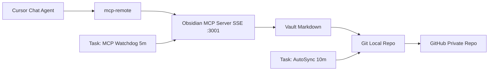

# Cursor + Obsidian Memory System

Guia completa para montar una memoria persistente, versionada y cross-device para Cursor usando Obsidian + MCP + GitHub.

## Para quien es

- personas que trabajan en multiples proyectos y quieren continuidad real;
- equipos que quieren estandarizar memoria operativa;
- builders que quieren un stack portable y auditable.

## Que obtienes

- memoria durable entre sesiones/dispositivos;
- organizacion global + por proyecto;
- sincronizacion automatica con GitHub;
- watchdog que relanza MCP si se cae;
- instalacion repetible en equipos nuevos.

## Tabla de contenido

- [Arquitectura](#arquitectura)
- [Instalacion](#instalacion)
- [Validacion](#validacion)
- [Operacion diaria](#operacion-diaria)
- [Seguridad](#seguridad)
- [Documentacion completa](#documentacion-completa)

## Arquitectura



### Por que funciona

El modelo no "recuerda todo" entre sesiones.  
Este sistema saca la memoria fuera del modelo y la guarda en Markdown:

- `MEMORY.md`: reglas/preferencias globales estables;
- `SESSION_LOG.md`: historial cronologico de decisiones;
- `PROJECTS/<proyecto>.md`: contexto y decisiones por proyecto.

Cursor consulta esa memoria por MCP y GitHub la replica entre dispositivos.

## Instalacion

### Opcion recomendada (quickstart)

1. Crea un repo privado para tu vault.
2. Copia `template/cursor-memory-vault/` a ese repo.
3. Ejecuta `template/cursor-memory-vault/CursorMemory-Install.cmd`.
4. Reinicia Cursor.
5. Pega `examples/CURSOR_USER_RULE_MEMORY.md` en User Rules.

Guia detallada: `docs/install-quickstart.md`.

### Opcion manual

Configura paso a paso y valida cada capa:

- `docs/install-manual.md`

### Opcion de equipo (operacion)

Incluye mantenimiento, recovery y rutina operativa:

- `docs/operations.md`

## Validacion

### 1) Salud local MCP

```powershell
powershell -ExecutionPolicy Bypass -File ".\scripts\health-check.ps1"
```

### 2) Diagnostico completo

```powershell
powershell -ExecutionPolicy Bypass -File ".\scripts\doctor.ps1"
```

### 3) Validacion desde Cursor

En chat:

1. "Usa `obsidian-memory` y lee `MEMORY.md`."
2. "Agrega una linea en `SESSION_LOG.md` con `test mcp ok`."

## Operacion diaria

- usa `PROJECTS/<proyecto>.md` para decisiones especificas;
- guarda checkpoints cada 3-5 mensajes si hubo avance;
- promueve aprendizajes durables a `MEMORY.md`;
- deja resumen corto al cierre en `SESSION_LOG.md`.

Prompts listos: `examples/PROMPTS.md`.

## Seguridad

- usa repo privado para memoria real;
- no guardes secretos ni credenciales;
- rota tokens si fueron expuestos;
- aplica principio de minimo privilegio.

Hardening completo: `docs/security-hardening.md`.

## Documentacion completa

- `docs/architecture.md`
- `docs/how-cursor-mcp-works.md`
- `docs/install-quickstart.md`
- `docs/install-manual.md`
- `docs/operations.md`
- `docs/troubleshooting.md`
- `docs/faq.md`
- `docs/security-hardening.md`
- `docs/adoption-playbook.md`

## Estructura del repo

- `template/cursor-memory-vault/`: vault y scripts listos.
- `examples/`: reglas y prompts listos para copiar.
- `scripts/`: checks operativos del sistema.
- `docs/`: guias tecnicas completas.

## Licencia

MIT
