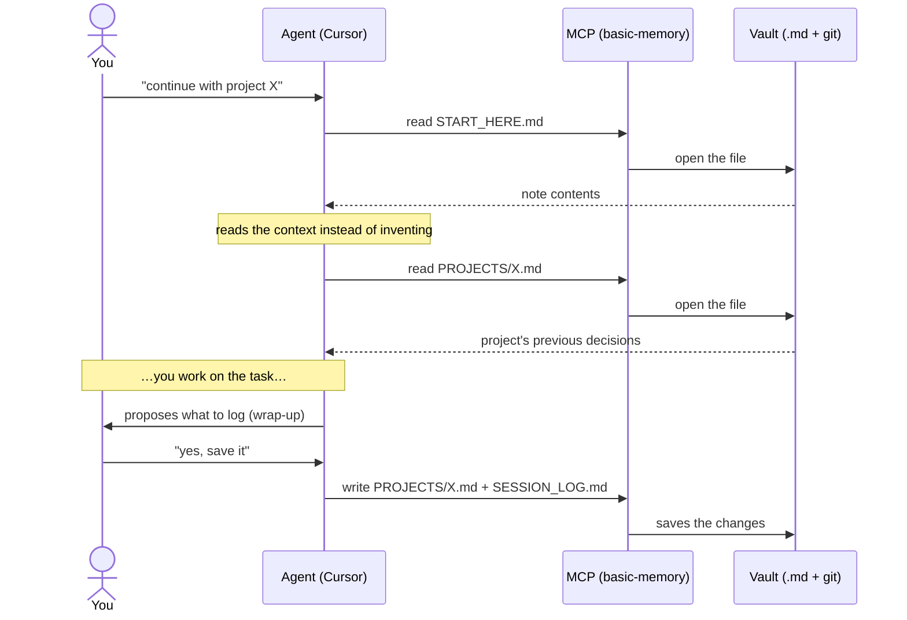

> [🇪🇸 Español](../es/como-funciona.md) · 🇬🇧 English

# How it works (a simple, visual explanation)

This page **does not assume** you know what an "MCP" or a "database" is. If you just want to
install, jump to the [installation guide](install.md). If you want to **understand** the idea
before touching anything, stay here: in 5 minutes you'll see the whole system.

---

## The problem in one sentence

> Chats with the AI **start blank every time**. What you agreed yesterday doesn't exist today,
> unless you carry it pasted into the prompt.

This kit gives the AI a **notebook** that survives between sessions. That notebook is made of
**text files** (Markdown) on **your** computer, in a folder you control. You can read them,
edit them, search them and version them with **git**, like any other project.

The memory **does not live inside the AI model**. It lives in your files. That makes it
auditable, portable and private.

---

## The full journey (at a glance)


Read it from left to right:

1. **You + the agent** (Cursor, Claude Code…) write in the usual chat.
2. The agent talks to the **MCP**, which is a **bridge**: it translates "I want to read/save a note"
   into real operations on files.
3. The bridge reads and writes in **your vault**: a folder of `.md` files under **git**.
4. At the bottom, an optional **daemon** watches the vault and **syncs** it with a remote (a private
   GitHub) so you have a backup and can use it from another machine.

Everything happens **locally**. There's no third-party server in the middle.

---

## The three pieces (and why all three are needed)

```text
   ┌─────────────┐      ┌──────────────┐      ┌──────────────────────┐
   │  1. VAULT   │      │   2. MCP     │      │   3. USER RULES      │
   │  folder of  │ <==> │  the bridge  │ <==  │  the "how to use"    │
   │  .md notes  │      │ (read/write) │      │  (Cursor only)       │
   └─────────────┘      └──────────────┘      └──────────────────────┘
     WHAT is saved        HOW it's accessed      WHEN to use it
```

### 1. The vault — the folder of notes (Markdown + git)

It's a normal folder with files such as:

| File                      | What it's for                                                                     |
| ------------------------- | --------------------------------------------------------------------------------- |
| `START_HERE.md`           | Short index: "where to begin". The first thing the agent reads.                   |
| `MEMORY.md`               | What you want it to remember **in general** (preferences, cross-cutting lessons). |
| `PROJECTS/<something>.md` | Context for **a specific project** (name similar to your work folder).            |
| `SESSION_LOG.md`          | Brief timeline: "what happened today" (decisions, wrap-ups).                      |

**Why git?** Because it gives you history (`git log`), version comparison and a private remote
for backup or another PC. **Careful:** the public repo you're reading **is not your vault**. Your
vault is **yours** and usually **private**.

### 2. The MCP — the bridge between the editor and the folder

**MCP** ("Model Context Protocol") is the mechanism by which your editor launches a small program and
asks it for operations: _read note_, _write note_, _search_. The default server is called
**`basic-memory`**. The **`BASIC_MEMORY_HOME`** variable tells it **which folder** is the vault —
without it, the AI doesn't know where to point.

> ⚠️ The MCP **doesn't "think"**. It only opens, saves and searches files. The model still decides what
> to ask for; the User Rules help it not skip steps.

### 3. The User Rules — the "how to use" (Cursor only)

They are a piece of text you paste into Cursor's settings. They **do not** replace the MCP (without an
MCP, the rules can't read the disk). They serve two purposes:

1. **Reading rhythm:** "start with `START_HERE`, then `MEMORY`, then the current project".
2. **Hygiene:** "don't save secrets", "log the wrap-ups in `SESSION_LOG`".

The ready-to-copy block is in the [installation guide](install.md#step-4--paste-the-user-rules-into-cursor).

---

## What happens when you chat (the flow, step by step)



None of this "uploads your notes forever" to a server owned by the AI provider. What persists is
**what gets written to your files** and what you upload to **your** remote if you set one up.

---

## Optional: search by words **and** by meaning

`basic-memory` already searches. If your vault is **large**, a local index speeds up and sharpens
the search. That's the **`obsidian-memory-rag`** package, exposed in the IDE by the **hybrid MCP**
with two tools:

| Tool                  | What it does                                                                                                                                                                                                                     |
| --------------------- | -------------------------------------------------------------------------------------------------------------------------------------------------------------------------------------------------------------------------------- |
| `vault_fts_search`    | **Lexical** search (SQLite FTS5 / BM25): fast and exact by keywords.                                                                                                                                                             |
| `vault_hybrid_search` | **Hybrid** search: mixes the lexical with the **semantic** (by meaning). "The daemon that syncs git" finds the note even if you don't use those exact words — and returns **only the relevant section**, which **saves tokens**. |

It's not required to get started. It's a layer of **convenience, better recall and token savings**,
not the core. Technical detail: [ADR-0017](../adr/0017-hybrid-query-embeddings.md).

---

## What it is **not** (to avoid confusion)

- It's **not** Cursor's native memory (the `memory://…` notices): that belongs to the IDE; this is
  **files** in the vault via MCP.
- It's **not** "the model's cloud memory": what persists are **your files** and **your git**.
- It does **not** replace Obsidian: you can use Obsidian or another editor; the vault is files.
- It does **not** guarantee perfect obedience: the rules improve behavior, but the model can make
  mistakes — that's why the vault is **reviewable by a human**.

---

## Several windows, one single vault

With the typical config (`BASIC_MEMORY_HOME` in your user `mcp.json`), **all** Cursor windows share
the **same** vault on disk. That's fine: use `PROJECTS/<repo>.md` so you don't mix contexts. Do you
need fully isolated memories? Set up **another** vault and another MCP entry (advanced).

---

## Next step

→ **Orderly, repeatable installation:** [`install.md`](install.md)
→ **Prefer to have an agent do it for you?** [`install-with-agent.md`](install-with-agent.md)
→ **Questions and comparison with alternatives:** [`faq.md`](faq.md) · **Glossary:** [`glossary.md`](glossary.md)
