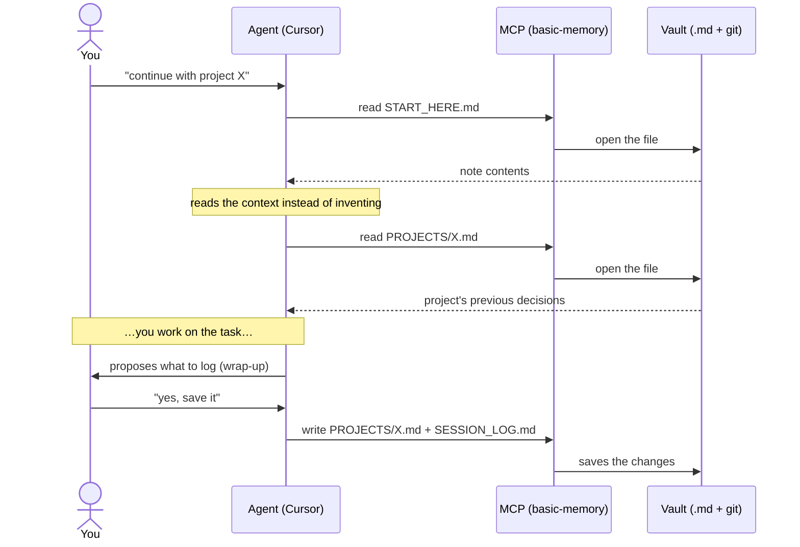
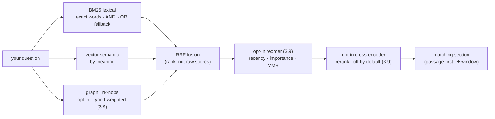
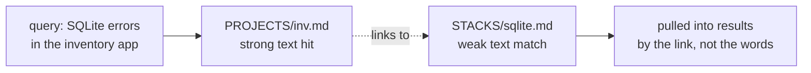
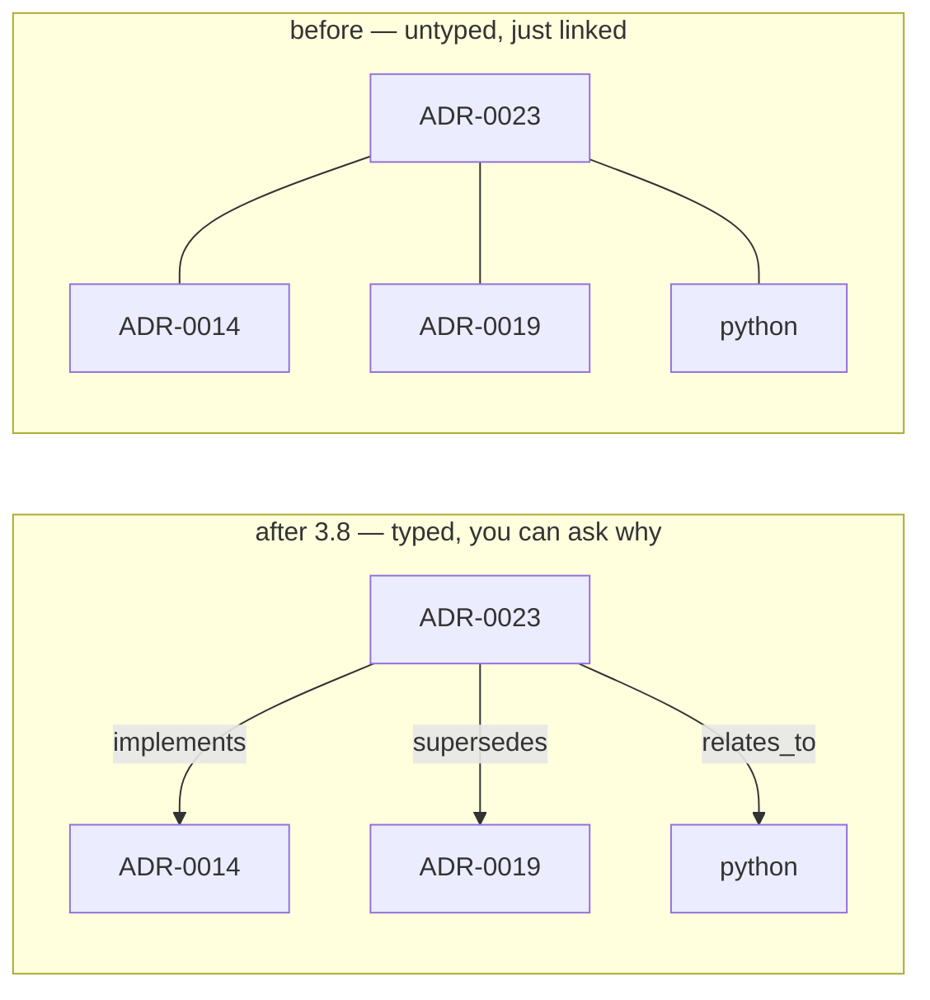
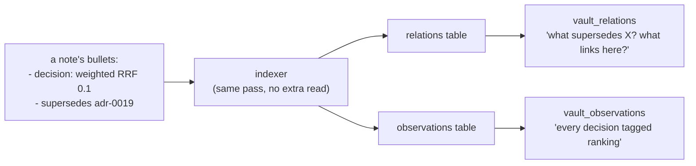
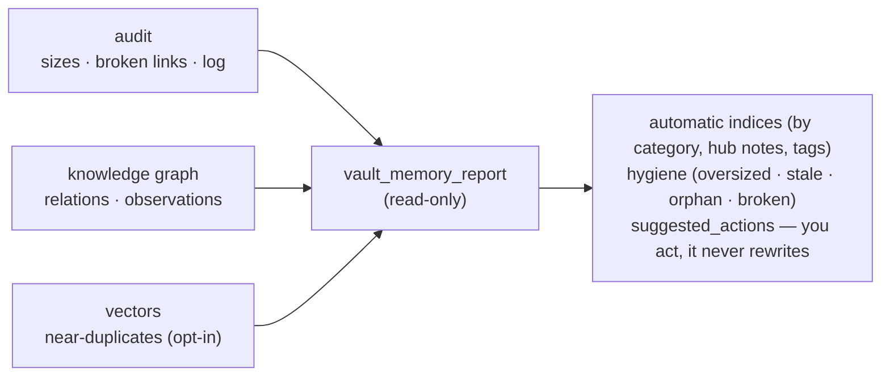
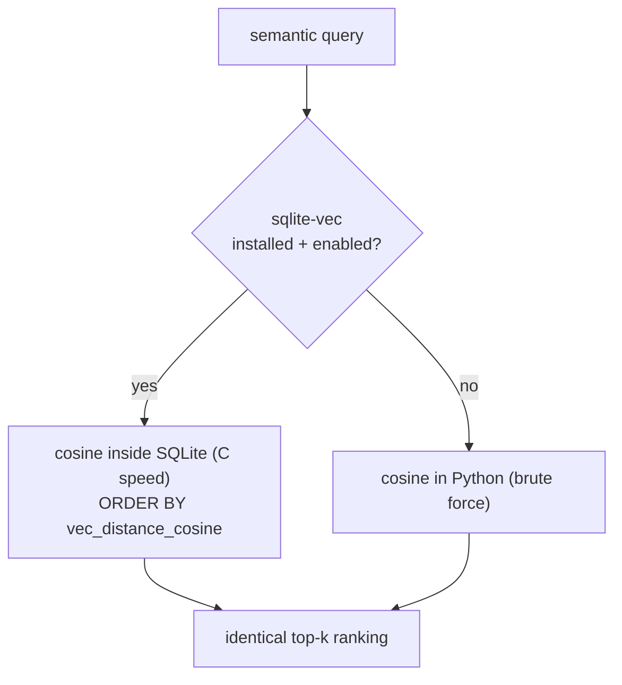
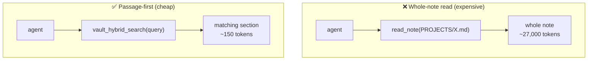
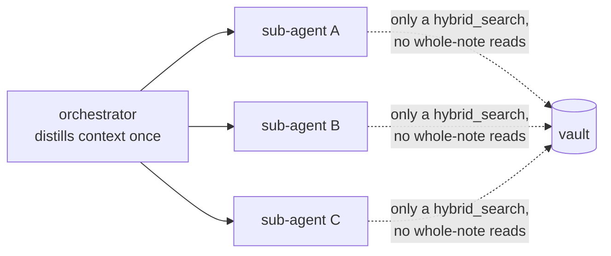

> [🇪🇸 Español](../es/como-funciona.md) · 🇬🇧 English

# How it works (a simple, visual explanation)

This page **does not assume** you know what an "MCP" or a "database" is. If you just want to
install, jump to the [installation guide](install.md). If you want to **understand** the idea
before touching anything, stay here: in 5 minutes you'll see the whole system.

---

## The problem in one sentence

> Chats with the AI **start blank every time**. What you agreed yesterday doesn't exist today,
> unless you carry it pasted into the prompt.

This kit gives the AI a **notebook** that survives between sessions. That notebook is made of
**text files** (Markdown) on **your** computer, in a folder you control. You can read them,
edit them, search them and version them with **git**, like any other project.

The memory **does not live inside the AI model**. It lives in your files. That makes it
auditable, portable and private.

---

## The full journey (at a glance)


Read it from left to right:

1. **You + the agent** (Cursor, Claude Code…) write in the usual chat.
2. The agent talks to the **MCP**, which is a **bridge**: it translates "I want to read/save a note"
   into real operations on files.
3. The bridge reads and writes in **your vault**: a folder of `.md` files under **git**.
4. At the bottom, an optional **daemon** watches the vault and **syncs** it with a remote (a private
   GitHub) so you have a backup and can use it from another machine.

Everything happens **locally**. There's no third-party server in the middle.

---

## The three pieces (and why all three are needed)

```text
   ┌─────────────┐      ┌──────────────┐      ┌──────────────────────┐
   │  1. VAULT   │      │   2. MCP     │      │   3. USER RULES      │
   │  folder of  │ <==> │  the bridge  │ <==  │  the "how to use"    │
   │  .md notes  │      │ (read/write) │      │  (usage rules)       │
   └─────────────┘      └──────────────┘      └──────────────────────┘
     WHAT is saved        HOW it's accessed      WHEN to use it
```

### 1. The vault — the folder of notes (Markdown + git)

It's a normal folder with files such as:

| File                      | What it's for                                                                     |
| ------------------------- | --------------------------------------------------------------------------------- |
| `START_HERE.md`           | Short index: "where to begin". The first thing the agent reads.                   |
| `MEMORY.md`               | What you want it to remember **in general** (preferences, cross-cutting lessons). |
| `PROJECTS/<something>.md` | Context for **a specific project** (name similar to your work folder).            |
| `SESSION_LOG.md`          | Brief timeline: "what happened today" (decisions, wrap-ups).                      |

**Why git?** Because it gives you history (`git log`), version comparison and a private remote
for backup or another PC. **Careful:** the public repo you're reading **is not your vault**. Your
vault is **yours** and usually **private**.

### 2. The MCP — the bridge between the editor and the folder

**MCP** ("Model Context Protocol") is the mechanism by which your editor launches a small program and
asks it for operations: _read note_, _write note_, _search_. The default server is called
**`basic-memory`**. The **`BASIC_MEMORY_HOME`** variable tells it **which folder** is the vault —
without it, the AI doesn't know where to point.

> ⚠️ The MCP **doesn't "think"**. It only opens, saves and searches files. The model still decides what
> to ask for; the User Rules help it not skip steps.

### 3. The User Rules — the "how to use" (Cursor) / `CLAUDE.md` (Claude Code)

They are a piece of text you paste into **Cursor → Settings → Rules → User Rules** — or, in
**Claude Code**, into `~/.claude/CLAUDE.md` (loaded automatically every session). They **do not**
replace the MCP (without an MCP, the rules can't read the disk). They serve two purposes:

1. **Reading rhythm:** "start with `START_HERE`, then `MEMORY`, then the current project".
2. **Hygiene:** "don't save secrets", "log the wrap-ups in `SESSION_LOG`".

The ready-to-copy block is in the [installation guide](install.md#step-4--paste-the-user-rules-into-cursor).

---

## What happens when you chat (the flow, step by step)



None of this "uploads your notes forever" to a server owned by the AI provider. What persists is
**what gets written to your files** and what you upload to **your** remote if you set one up.

---

## Optional: search by words **and** by meaning

`basic-memory` already searches. If your vault is **large**, a local index speeds up and sharpens
the search. That's the **`obsidian-memory-rag`** package, exposed in the IDE by the **hybrid MCP**
with these tools:

| Tool                  | What it does                                                                                                                                                                                                                                                                                                                                                                                                                                                                                                                                                                                                                                                                                                                                                                                                      |
| --------------------- | ----------------------------------------------------------------------------------------------------------------------------------------------------------------------------------------------------------------------------------------------------------------------------------------------------------------------------------------------------------------------------------------------------------------------------------------------------------------------------------------------------------------------------------------------------------------------------------------------------------------------------------------------------------------------------------------------------------------------------------------------------------------------------------------------------------------- |
| `vault_fts_search`    | **Lexical** search (SQLite FTS5 / BM25): fast and exact by keywords.                                                                                                                                                                                                                                                                                                                                                                                                                                                                                                                                                                                                                                                                                                                                              |
| `vault_hybrid_search` | **Hybrid** search: mixes the lexical with the **semantic** (by meaning). "The daemon that syncs git" finds the note even if you don't use those exact words — and returns **only the relevant section**, which **saves tokens**. With `graph: true` it also follows your `[[wikilinks]]`, so a note linked from a strong hit surfaces even when its own text barely matches (ADR-0019); with `recency: true` it favors recently-modified notes (ADR-0021). More **opt-in, off-by-default** precision knobs (3.9): `rerank: true` adds a cross-encoder final pass for hard queries (ADR-0026, needs the `[rerank]` extra + a language-matched model), `graphTyped`/`importance` weight typed relations / hub notes (ADR-0027), and `mmr` / `passageWindow` diversify results / return a fuller section (ADR-0028). |
| `vault_complete`      | **Autocomplete** a prefix to the note titles, filenames and `#tags` that actually exist — handy to resolve a half-remembered name before searching or linking.                                                                                                                                                                                                                                                                                                                                                                                                                                                                                                                                                                                                                                                    |

It's not required to get started. It's a layer of **convenience, better recall and token savings**,
not the core. Technical detail: [ADR-0017](../adr/0017-hybrid-query-embeddings.md) (hybrid query) and
[ADR-0019](../adr/0019-graph-aware-retrieval.md) (graph-aware recall + autocomplete).

### The retrieval stack at a glance (old + new)

The same question is answered by **three rankers at once**, then **fused** — none wins outright, which is what keeps results balanced. Lexical and semantic are the original layers; the **graph** ranker is opt-in (new in 3.5). Newer **opt-in, off-by-default** stages (3.9) can then sharpen the order: a light reorder (recency · importance · MMR diversification) and an optional **cross-encoder reranker** that re-reads each candidate _with_ the query. Everything after RRF is off unless you ask for it, so the default path is unchanged:



The reranker is the precision lever: RRF orders by _rank position_, but a cross-encoder reads the query and a candidate passage **together** and can promote the genuinely-right note to the top. It is off by default and only helps with a strong, content-language-matched model (the multilingual default) — so it ships behind the `[rerank]` extra, never in the measured default path.

**What the graph step adds.** A note that barely matches the words can still be the most relevant one when a strong hit links to it. The graph follows those `[[wikilinks]]` so the companion note surfaces anyway:



(`vault_complete` is the small sibling: type a prefix, get the titles / filenames / `#tags` that actually exist — a Trie lookup, no search needed.)

### Measured, not just claimed (new in 3.7)

"Surfaces the right note" is no longer just a claim — it's a number. A fixed, labelled corpus
plus query set is scored on every change (**recall@k / MRR / hit@1**), and a regression **fails
the build** in CI. On the dependency-free embedder the floor is **recall@5 = 1.000, MRR = 0.972,
hit@1 = 0.944** (a neural embedder only raises it). The lexical layer also **falls back from AND
to OR** when a strict match finds nothing, so one missing or mistyped word no longer drops a
relevant note. Detail: [`evals/retrieval`](https://github.com/Vahlame/obsidian-memory-kit/tree/main/evals/retrieval) ·
[ADR-0020](../adr/0020-measured-retrieval-quality.md).

### Asking the graph questions — typed relations + observations (new in 3.8)

**The analogy.** A plain search finds a book by its title. The **knowledge graph** is the library's
**card catalog** on top of the books: cross-reference cards that say _how_ two books relate ("this
one _implements_ that one", "this edition _supersedes_ that one") and subject cards that file each
fact under a heading ("this is a _decision_", "this is a _gotcha_"). The books — your Markdown notes
— never move; the catalog just makes them **answerable** in ways shelf order can't.

**What changed.** Before, every link between notes was the same anonymous arrow — "A links to B", no
reason attached. Now a link can carry a **verb** (a _typed relation_) and a fact can carry a
**category** (an _observation_). Two plain-Markdown conventions, the same ones
[Basic Memory](faq.md) uses (so vaults interoperate):

- A **typed relation** — a list item `- <verb> [[target]]`, e.g. `- implements [[adr-0014]]` or
  `- supersedes [[adr-0019]]`. A bare `[[link]]` is still kept, as an untyped `relates_to`.
- An **observation** — a list item `- [category] fact #tags`, e.g.
  `- [decision] weighted RRF weight 0.1 #ranking`.

The same three links, before vs. after — the arrows go from anonymous to labelled:



The indexer reads these straight out of your notes — **no new file, no extra step** — into two
queryable tables, in the very same pass that builds the search index:



So the agent can now answer questions plain search _cannot phrase_: "what supersedes ADR-0019? what
links to `python`?" (`vault_relations`, both directions); "show every `[decision]` tagged `#ranking`"
(`vault_observations`). And `vault_kg_suggest` reads a note and **proposes** relations/observations
from its prose — but **never writes**; you confirm and edit. Detail:
[ADR-0023](../adr/0023-structured-knowledge-graph.md).

### Keeping memory healthy — the memory report (new in 3.8)

**The analogy.** A yearly **health check-up**, or the dashboard warning lights in a car. As a vault
grows it can quietly get unhealthy — a bloated log, notes that grew too big, links pointing nowhere,
notes connected to nothing. `vault_memory_report` is the check-up: it **reads** everything and hands
you a chart. It performs no surgery — it never rewrites a note — it just tells you what to look at.

It composes three signals the kit already has into one **read-only** digest:



On the maintainer's real 55-note vault it instantly surfaced: `SESSION_LOG` over budget, 6 oversized
notes, 13 broken links, 8 orphan notes, and the true graph hubs. Two honest scopes: **"detect
contradictions"** surfaces _near-duplicate pairs to review_, not a verdict (true contradiction
detection is semantic reasoning the deterministic engine doesn't claim); **"condense old notes"**
means the report _flags_ candidates and the agent condenses with your confirmation. Detail:
[ADR-0024](../adr/0024-memory-reports-and-compaction.md).

### Scaling semantic search — optional sqlite-vec (new in 3.8)

**The analogy.** _Same recipe, faster oven._ The math — **cosine similarity** between your query and
each note chunk — does not change at all. We just move it from being computed chunk-by-chunk in
Python to being computed by a built-in C appliance _inside SQLite_ (the **sqlite-vec** extension),
which only matters once a vault has thousands of notes. If that appliance isn't plugged in, you fall
back to doing it by hand — **same result, search never breaks**:



Because the vectors are L2-normalized, ascending cosine _distance_ is exactly descending _similarity_
— so the ranking is **provably identical** (the retrieval bench is byte-for-byte the same with it on
or off). It stays inside the **same** `fts.sqlite` — no second store, no server — which is why it's
the in-file answer, and why **Chroma / LanceDB were declined**: heavyweight stores that would break
the zero-dependency, single-file design to solve a non-problem at personal scale. Detail:
[ADR-0025](../adr/0025-optional-sqlite-vec-acceleration.md).

### Why this saves tokens (and scales to many agents)

A whole-note read pours the **entire** note into the model's context. Passage-first retrieval
returns just the **matching section** — usually a few hundred tokens instead of tens of thousands:



This matters most with **many agents**: if you fan out N sub-agents and each reads whole notes, the
cost multiplies by N. The rule (ADR-0018): the **orchestrator** fetches and distills context **once**
and passes the excerpt to each sub-agent; sub-agents only `vault_hybrid_search` their subtask and
never re-read the whole vault.



---

## What it is **not** (to avoid confusion)

- It's **not** Cursor's native memory (the `memory://…` notices): that belongs to the IDE; this is
  **files** in the vault via MCP.
- It's **not** "the model's cloud memory": what persists are **your files** and **your git**.
- It does **not** replace Obsidian: you can use Obsidian or another editor; the vault is files.
- It does **not** guarantee perfect obedience: the rules improve behavior, but the model can make
  mistakes — that's why the vault is **reviewable by a human**.

---

## Several windows, one single vault

With the typical config (`BASIC_MEMORY_HOME` in your user `mcp.json`), **all** Cursor windows share
the **same** vault on disk. That's fine: use `PROJECTS/<repo>.md` so you don't mix contexts. Do you
need fully isolated memories? Set up **another** vault and another MCP entry (advanced).

---

## Next step

→ **Orderly, repeatable installation:** [`install.md`](install.md)
→ **Prefer to have an agent do it for you?** [`install-with-agent.md`](install-with-agent.md)
→ **Questions and comparison with alternatives:** [`faq.md`](faq.md) · **Glossary:** [`glossary.md`](glossary.md)
