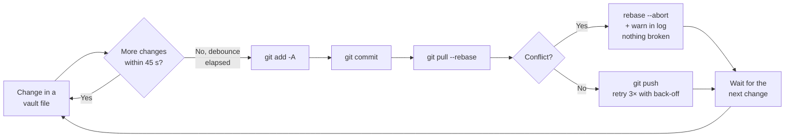

> [🇪🇸 Español](../es/sincronizacion.md) · 🇬🇧 English

# Syncing the vault with git

The **vault** is the Markdown folder where the agent keeps its memory (`MEMORY.md`, `PROJECTS/`, `STACKS/`, etc.). Syncing it with **git** (the system that versions your files and pushes them to a remote repository, e.g. on GitHub) gives you three things:

- **History** — every change is recorded; you can see what was noted and when, and roll back if something was deleted by mistake.
- **Backup** — if the disk fails, your memory lives on the remote.
- **Multi-machine** — work on the laptop, continue on the desktop; a `git pull` brings in the latest.

The question isn't _whether_ to sync, but _how_: by hand, with a program that does it for you, or by piggybacking on a repo you already update. There are **three options**, plus a section below for the fine Windows details.

> → If you haven't installed the kit yet, start with the [install guide](install.md). This page assumes the vault already exists and is a git repository with a configured remote.

## How the daemon syncs (at a glance)

Option A uses a **daemon**: a small program that runs in the background, watches the folder, and syncs only when it detects changes. Its loop looks like this:



Two key ideas from the diagram:

- **Debounce** — the daemon **waits** a margin after the last change before syncing (default **45 seconds**). So if you save ten times in a row, it does **one** sync at the end instead of ten. This avoids hammering the remote and the disk.
- **Sync order** — always `add → commit → pull --rebase → push`, in that exact order. It's not arbitrary: see [Option B](#option-b-the-simplest-git-by-hand) and [ADR-0004](../adr/0004-sync-order-add-commit-pull-push.md).

---

## The three options at a glance

| Option                                  | Effort     | Automatic             | When to choose it                                                |
| --------------------------------------- | ---------- | --------------------- | ---------------------------------------------------------------- |
| **A — `obsidian-memoryd watch` daemon** | Build once | Yes, on save          | You want "set it and forget it"; the vault is a separate folder. |
| **B — git by hand**                     | Zero setup | No, you decide        | You prefer full control and don't mind typing a few commands.    |
| **C — memory in the same repo**         | Zero extra | With your normal flow | You already version a project and want the memory inside it.     |

---

## Option A (recommended): the `obsidian-memoryd watch` daemon

`obsidian-memoryd` is the **daemon** (background program) that ships with the kit. It watches the vault folder and, when it detects a change, waits out the debounce and does the full sync for you. Its source is in [`../../cmd/obsidian-memoryd/`](../../cmd/obsidian-memoryd/).

### Building it

You need [Go](https://go.dev) installed. On Windows, build it as a **GUI-subsystem application** with the `-H windowsgui` flag, which makes the `.exe` **open no console window at all** (neither its own nor that of the `git` processes it spawns internally):

```bash
go build -ldflags="-H windowsgui" -o bin/obsidian-memoryd.exe ./cmd/obsidian-memoryd
```

> ✅ On Linux and macOS you don't need `-ldflags`; `go build -o bin/obsidian-memoryd ./cmd/obsidian-memoryd` is enough. Console hiding is Windows-specific.

The kit already includes two files that guarantee zero consoles on Windows even when the `.exe` is GUI-subsystem: `proc_windows.go` spawns each `git` subprocess with the flags `CREATE_NO_WINDOW + HideWindow: true`; `proc_other.go` is a no-op on Linux/macOS. You don't need to touch them.

### Starting it

The daemon picks its vault, in order of preference: the `BASIC_MEMORY_HOME` environment variable, then `OBSIDIAN_MEMORY_VAULT`, and if neither is set, **the folder it's run from** (its working directory). You can also pass it explicitly with `--vault`:

```bash
obsidian-memoryd watch --vault "C:\ABSOLUTE\PATH\TO\VAULT"
```

To have it start silently at login on Windows, the cleanest way is a **shortcut in the Startup folder**:

- **Target**: the compiled `.exe`.
- **Arguments**: `watch`.
- **Start in**: the vault root (so the daemon uses that folder even if you don't set `BASIC_MEMORY_HOME`).

> ⚠️ Do **not** wrap the shortcut in `cmd.exe` or `powershell.exe`: that reintroduces the console flash that `-H windowsgui` removed.

### Tuning the frequency

The default debounce is **45 seconds**. Change it with the `OBSIDIAN_MEMORY_DEBOUNCE` variable, which accepts a Go-style duration (`30s`, `2m`, `5m`). The bounds are **minimum 5 s** and **maximum 15 m**; a value out of range or unparseable is ignored and falls back to the 45 s default.

```powershell
setx OBSIDIAN_MEMORY_DEBOUNCE 2m
```

Raising the debounce (e.g. `2m` or `5m`) is useful if you don't want constant micro-commits, or if you game and prefer fewer disk spikes (see [Windows: details](#syncing-without-stutter-while-gaming)).

### What it does on each sync

The daemon runs the safe order `add → commit → pull --rebase → push`, with safeguards you wouldn't have by hand:

- An **empty commit** (nothing to save) is detected and skipped — it's not an error.
- If `pull --rebase` hits a **conflict**, it runs `rebase --abort` automatically and warns you in the log so you can resolve it yourself; it never leaves the repo half-done or force-pushes anything.
- The `push` **retries up to 3 times** with growing back-off, in case the remote bounces for a moment.
- It runs `git` with `GIT_TERMINAL_PROMPT=0`, so if credentials are missing it fails fast instead of hanging on a password prompt no one will type.

### Health check: `doctor`

Since the daemon runs hidden, you need a way to ask it "are you still alive and pushing?". That's `doctor`:

```bash
obsidian-memoryd doctor
```

It shows the **heartbeat** (the daemon refreshes it every 60 s; if it's been more than **5 minutes** without a beat, it's probably down), the last successful `push`, how many commits you have unpushed, recent rebase aborts, and consecutive push failures. If something is wrong, it prints **ALARM** and points you to `obsidian-memoryd inspect --last 30` for the log detail.

> → Rule of thumb: if `doctor` says the last push was **more than a day ago**, the daemon is almost certainly stopped or the remote is rejecting. Look into it.

### Other useful subcommands

```bash
obsidian-memoryd sync once                    # force ONE sync now and exit
obsidian-memoryd inspect --last 30            # last N log lines
obsidian-memoryd service install --user       # install it as a system service
obsidian-memoryd service start  --user        # (alternative to the Startup shortcut)
obsidian-memoryd service stop   --user
obsidian-memoryd service status --user
```

---

## Option B (the simplest): git by hand

Zero configuration, zero background programs: you decide when to converge with the remote. Open a terminal **in the vault folder** and run:

```bash
git status
git add -A
git commit -m "memory"   # only if there are changes
git pull --rebase
git push
```

The order matters and is always the same: **`add → commit` (if anything) `→ pull --rebase → push`** ([ADR-0004](../adr/0004-sync-order-add-commit-pull-push.md)). The reason:

- If you run `git pull --rebase` with **unstaged** changes (no `add`), Git refuses: _cannot pull with rebase: You have unstaged changes_. That's why `add` (and `commit`) go **before** the pull.
- If you `push` **before** you `pull`, Git rejects it when another machine has already pushed. That's why the pull goes **before** the push.

This order works whether or not there are local changes, and recovers cleanly when the remote has moved ahead. (It's exactly what Option A automates.)

---

## Option C (alternative): memory inside the same git repo you already use

If you already have a **git repository you update with your normal flow** (your project, your fork, your personal setup), you can put the agent's memory **inside that same repo**. Then a single `git pull` / `git push` keeps **code + docs + memory** aligned, with no second timer or daemon whose only job is to "refresh memory".

**How:**

1. Use a **private git clone** (don't push secrets to a public repo).
2. In your client (Cursor, Claude Code…), point `BASIC_MEMORY_HOME` at an **absolute path inside that clone**, e.g. `D:\work\my-setup\memory`, or the repo root if the notes live there.
3. Open that folder as the workspace root so its `.vscode` settings apply (see [Windows: details](#avoiding-flickering-console-windows)).

**Suggested layout (private repo):**

```text
my-agent-memory/
  memory/                 # BASIC_MEMORY_HOME = this folder
    .obsidian/            # optional (Obsidian); basic-memory doesn't require it
    START_HERE.md
    MEMORY.md
    SESSION_LOG.md
    PROJECTS/
  README.md               # how to open the project in your client
```

| What you want to update                    | How, with no extra local automation                                       |
| ------------------------------------------ | ------------------------------------------------------------------------- |
| **Public-kit** templates and docs          | `git pull` from upstream into your fork/clone; merge or rebase as usual.  |
| **Your** notes (`MEMORY.md`, `PROJECTS/`…) | Same repo: commit + push when you finish; on another machine, `git pull`. |

> ⚠️ **Honest limit:** "background auto-sync with no actor at all" doesn't exist. Either **you** run `git pull`/`push`, or you add **cloud CI** (e.g. GitHub Actions in _your_ repo) — which isn't a task on your PC, but is server-side automation. This option assumes **git only, on your machine**.

---

## Windows: details

This section gathers the Windows-specific bits. If you're on Linux or macOS, you can skip it.

### Avoiding flickering console windows

On Windows, certain processes pop a black console window that flickers and steals focus. The usual culprits are **the IDE** (Git and extensions), **MCP servers** (`node`, `uvx`, `npx`), and **scheduled tasks** that launch `powershell.exe` or `cmd.exe`. To get close to "zero flashes" in normal vault use:

- **Always open the right folder.** The repo's settings live in **`.vscode/settings.json`** and only apply if you open the **root directory** of the repo or vault (**File → Open Folder**), not a loose file. After updating the repo, run **Developer: Reload Window** once.
- **Settings already included.** The SCM settings ship at the repo-root `.vscode/settings.json` and the initializer writes the same defaults into `<vault>/.vscode/settings.json`. They disable aggressive Git polling, some SCM decoration, and exclude noisy paths from the watcher (`.obsidian/`, build caches). They also set `git.terminalAuthentication: false` so Git doesn't force a console when authenticating.
- **If you see windows titled `…\Git\bin\git.exe` or `bin\sh.exe`**, pin the path to the "clean" git in your JSON (User or workspace):

  ```json
  { "git.path": "C:\\Program Files\\Git\\cmd\\git.exe" }
  ```

  Note: that's the `cmd\git.exe`, **not** the one in `bin\`. On Windows, the kit's initializer tries to write this `git.path` when merging the vault if that path exists.

- **If you want the live Git panel** in a specific folder, edit **your copy** of `.vscode/settings.json` and set `git.autorefresh` back to `true` (at the cost of accepting more `git`/`conhost` processes).
- **MCP and extensions.** Each MCP server with a `command` (`uvx`, `node`, `npx`) can spawn a console; reduce active MCPs in **Settings → MCP** and disable extensions that run Git or shells in a loop (try without GitLens). To diagnose, open **Task Manager → Details** (command-line column) while you reproduce the flicker.

> ⚠️ **Honest limit:** there's no Markdown switch that guarantees zero windows across **every** combination of extensions, MCPs, and system tasks. The kit applies workspace settings + guidance to get close to "zero flashes" in normal use. Remember that Option A, built with `-H windowsgui`, **does** guarantee zero console for the daemon itself.

### Syncing without stutter while gaming

If you game in fullscreen, you don't want disk/Git spikes or consoles stealing focus. The principle is to **separate "when I sync" from "when I play"**:

- **Raise the debounce or disable syncing** during the session. With Option A, `setx OBSIDIAN_MEMORY_DEBOUNCE 5m` lowers the frequency; or close the daemon while you play. With git by hand (Option B) you control the timing by definition.
- **Avoid two separate automations** that run `git` at the same cadence: redundancy = more I/O. A single channel (daemon **or** manual git) is enough.
- **Close the IDE.** Cursor/VS Code with the vault open in the same session as a competitive game is **still heavy** (Git, extensions, MCP). The cleanest move: **close the IDE** while gaming, or don't open the vault folder until you're done.
- **If you see `conhost`/a console while gaming**, it usually comes from the IDE, its extensions, the IDE's Git, or another app (launcher, overlay, antivirus). Identify it with **Task Manager → Details** (command line) while it happens.

| Situation                                     | What to do                                                                      |
| --------------------------------------------- | ------------------------------------------------------------------------------- |
| Memory up to date without disturbing the game | Long debounce, or disable the daemon before playing and re-enable it after.     |
| Less lag with the IDE open                    | Vault's `.vscode` + fewer MCPs/extensions; ideally **no** IDE during the match. |
| No console flashes                            | IDE with calmed Git settings; a single sync channel.                            |

If you used the Windows **Task Scheduler** for something of your own, you can pause and re-enable it (adjust the names to yours):

```powershell
# Pause before playing
Get-ScheduledTask -TaskName 'CursorMemoryVaultSync' -ErrorAction SilentlyContinue |
  Disable-ScheduledTask

# Re-enable afterwards
Get-ScheduledTask -TaskName 'CursorMemoryVaultSync' -ErrorAction SilentlyContinue |
  Enable-ScheduledTask
```

### (Optional, advanced) `basic-memory` over HTTP "always on"

This is independent of git syncing: it's about how the client **reads** the memory, not how it's versioned. By default, `basic-memory` (the MCP server that serves the vault) starts **over stdio**: the client launches it with `uvx` when needed, and you need no separate process and no port to worry about. **This is the recommended option.**

If instead you want a **persistent HTTP listener** (Streamable HTTP) that's always on, start it in a terminal (you can minimize it):

```powershell
$env:BASIC_MEMORY_HOME = "C:\ABSOLUTE\PATH\TO\VAULT"
uvx basic-memory mcp --transport streamable-http --host 127.0.0.1 --port 8765 --path /mcp
```

In `mcp.json`, the `basic-memory` entry must use the **same** URL and **no** `command`/`uvx`:

```json
{ "url": "http://127.0.0.1:8765/mcp" }
```

The kit's default port is **8765**, chosen to avoid clashes with the usual development ports (**8000**, **8080**, **3000**) — see [ADR-0016](../adr/0016-localhost-mcp-default-port.md). If **8765** is already taken, pick another free one (e.g. **8877**) and use **exactly the same** in the `uvx` line and in `mcp.json`. To check the listener is alive:

```powershell
Test-NetConnection 127.0.0.1 -Port 8765
```

Then, in the client: **Settings → MCP** should show `basic-memory` in green. After editing `mcp.json`, **restart the client** or run **Developer: Reload Window**.

> ⚠️ Do **not** expose this listener to the network without TLS and authentication. It's meant for `127.0.0.1` (your own machine) and nothing else. To go back to stdio: stop the process holding the port (`Get-NetTCPConnection` / Task Manager) and restore the stdio block in `mcp.json`.

---

## Vault maintenance (keep it cheap to read)

Over time the vault grows and reading whole notes gets expensive — especially with fan-out (each
full read is multiplied × N agents). Three tools keep it healthy (part of
[ADR-0018](../adr/0018-multi-agent-token-efficiency.md)):

| Command / tool                                               | What it does                                                                                                                                       |
| ------------------------------------------------------------ | -------------------------------------------------------------------------------------------------------------------------------------------------- |
| `obsidian-memory-rag audit --vault "<VAULT>"`                | Lists notes over the token budget (~8k), broken `[[wikilinks]]`, and `SESSION_LOG.md` size. Also the **`vault_audit`** MCP tool.                   |
| `obsidian-memory-rag rotate-log --vault "<VAULT>" --keep 12` | Archives old `SESSION_LOG.md` sections to `SESSION_LOG/archive.md`, keeping the most recent 12. Non-destructive.                                   |
| **`vault_hybrid_search`** (search habit, MCP tool)           | The everyday lever: returns the **matching section** instead of the whole note, so reads stay cheap as the vault grows. Use it before a full read. |

> **Golden rule for savings:** let the agent search with `vault_hybrid_search` (returns **only the
> relevant section**) instead of reading whole notes, and keep large notes (history, logs) as
> **archives** read on demand. Details in the [install guide, User Rules](install.md#step-4--paste-the-user-rules-into-cursor).
