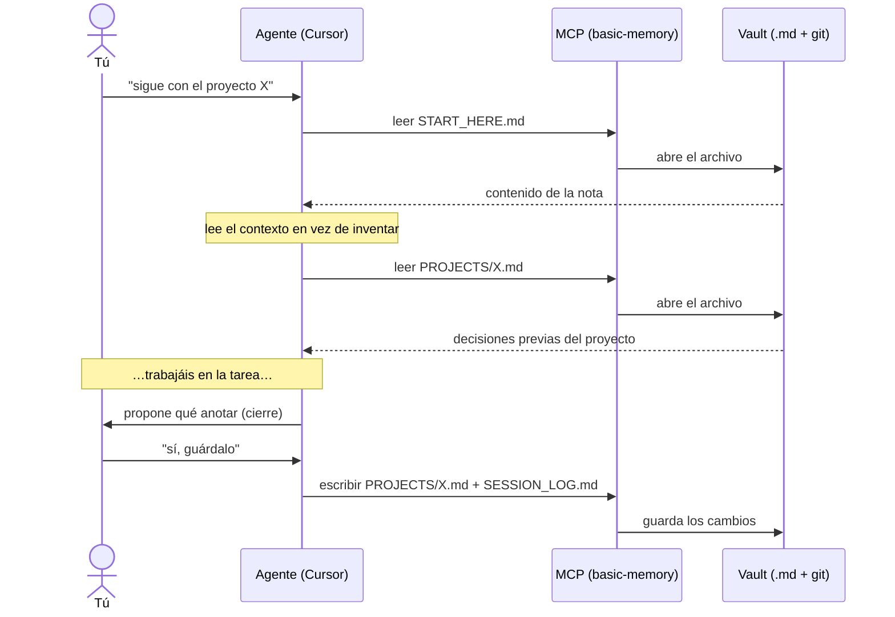
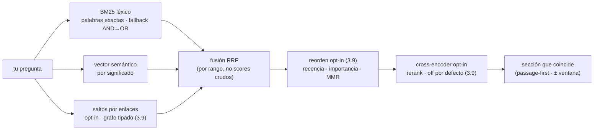
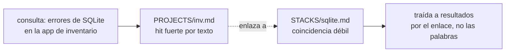
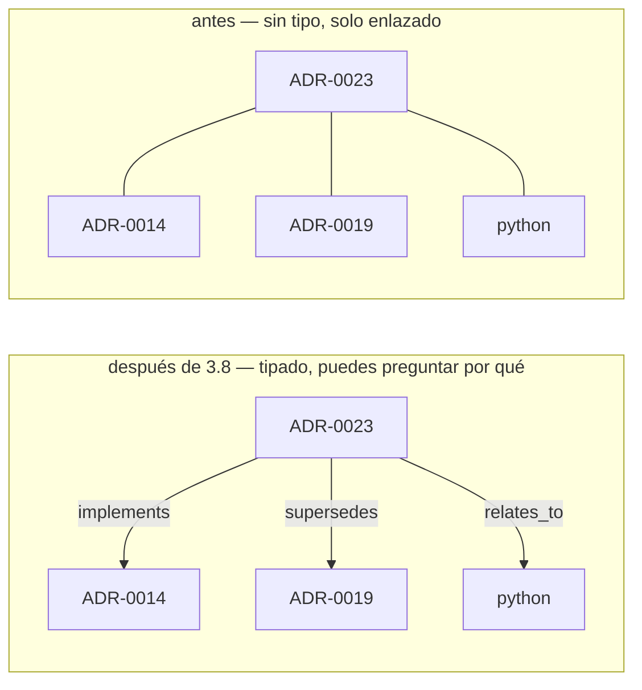
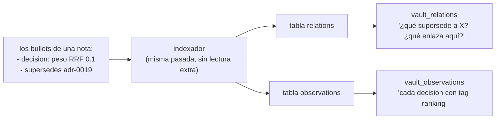
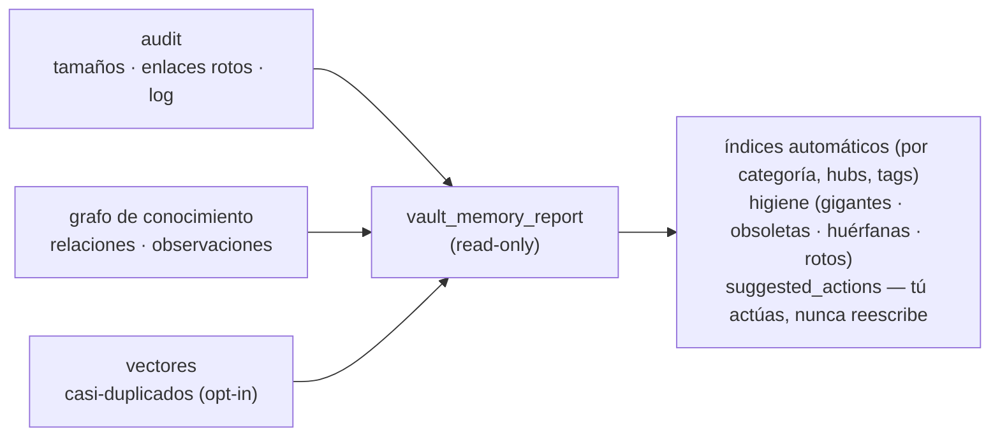
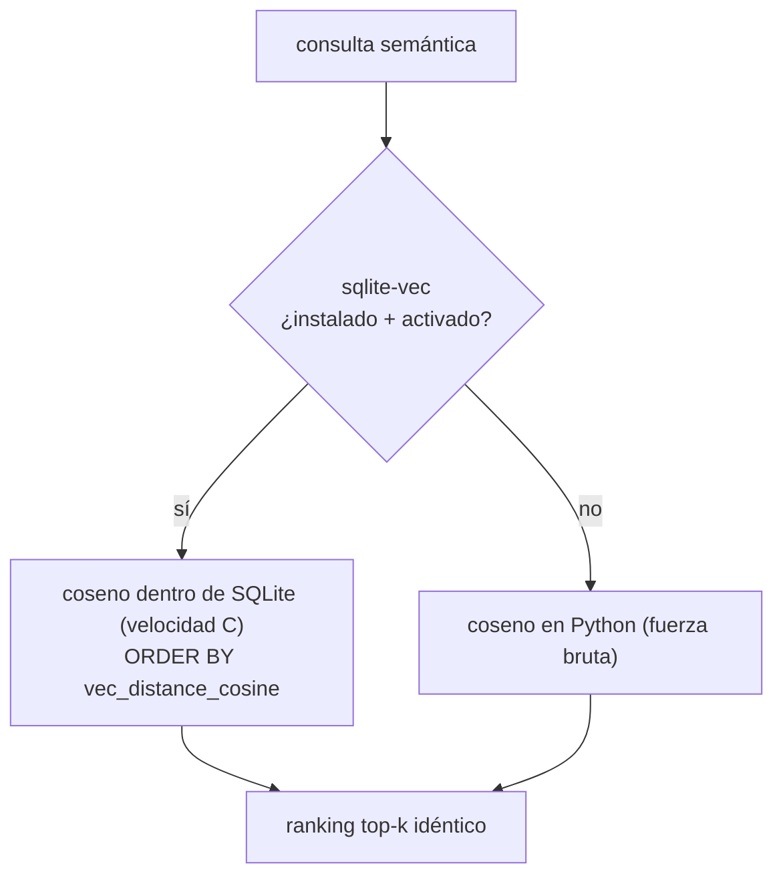
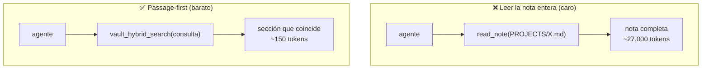
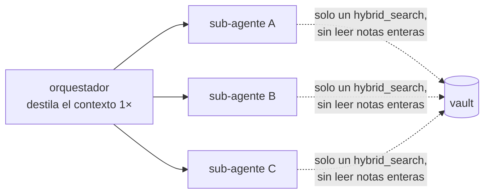

> 🇪🇸 Español · [🇬🇧 English](../en/how-it-works.md)

# Cómo funciona (explicación sencilla y visual)

Esta página **no asume** que sepas qué es un "MCP" ni una "base de datos". Si solo quieres
instalar, salta a la [guía de instalación](instalacion.md). Si quieres **entender** la idea
antes de tocar nada, sigue aquí: en 5 minutos verás el sistema completo.

---

## El problema en una frase

> Los chats con la IA **empiezan en blanco cada vez**. Lo que acordaste ayer no existe hoy,
> salvo que lo lleves pegado en el prompt.

Este kit le da a la IA una **libreta** que sobrevive entre sesiones. Esa libreta son
**archivos de texto** (Markdown) en **tu** ordenador, en una carpeta que tú controlas. Puedes
leerlos, editarlos, buscarlos y versionarlos con **git**, como cualquier otro proyecto.

La memoria **no vive dentro del modelo de IA**. Vive en tus archivos. Eso la hace auditable,
portable y privada.

---

## El recorrido completo (de un vistazo)


Léelo de izquierda a derecha:

1. **Tú + el agente** (Cursor, Claude Code…) escribís en el chat de siempre.
2. El agente habla con el **MCP**, que es un **puente**: traduce "quiero leer/guardar una nota"
   en operaciones reales sobre archivos.
3. El puente lee y escribe en **tu vault**: una carpeta con archivos `.md` bajo **git**.
4. Abajo, un **daemon** opcional vigila el vault y lo **sincroniza** con un remoto (GitHub
   privado) para tener copia de seguridad y usarlo desde otra máquina.

Todo ocurre **en local**. No hay servidor de terceros en medio.

---

## Las tres piezas (y por qué hacen falta las tres)

```text
   ┌─────────────┐      ┌──────────────┐      ┌──────────────────────┐
   │  1. VAULT   │      │   2. MCP     │      │   3. USER RULES      │
   │  carpeta de │ <==> │  el puente   │ <==  │  el "modo de uso"    │
   │  notas .md  │      │ (lee/escribe)│      │  (reglas de uso)     │
   └─────────────┘      └──────────────┘      └──────────────────────┘
     QUÉ se guarda         CÓMO se accede        CUÁNDO usarlo
```

### 1. El vault — la carpeta de notas (Markdown + git)

Es una carpeta normal con archivos como:

| Archivo              | Para qué sirve                                                                      |
| -------------------- | ----------------------------------------------------------------------------------- |
| `START_HERE.md`      | Índice corto: "por dónde empezar". Lo primero que lee el agente.                    |
| `MEMORY.md`          | Lo que quieres que recuerde **en general** (preferencias, lecciones transversales). |
| `PROJECTS/<algo>.md` | Contexto de **un proyecto concreto** (nombre parecido a tu carpeta de trabajo).     |
| `SESSION_LOG.md`     | Línea de tiempo breve: "qué pasó hoy" (decisiones, cierres).                        |

**¿Por qué git?** Porque te da historial (`git log`), comparar versiones y un remoto privado
para backup u otro PC. **Ojo:** el repo público que estás leyendo **no es tu vault**. Tu vault
es **tuyo** y normalmente **privado**.

### 2. El MCP — el puente entre el editor y la carpeta

**MCP** ("Model Context Protocol") es el mecanismo por el que tu editor lanza un programita y
le pide operaciones: _leer nota_, _escribir nota_, _buscar_. El servidor por defecto se llama
**`basic-memory`**. La variable **`BASIC_MEMORY_HOME`** le dice **qué carpeta** es el vault —
sin eso, la IA no sabe a dónde apuntar.

> ⚠️ El MCP **no "piensa"**. Solo abre, guarda y busca archivos. El modelo sigue decidiendo qué
> pedir; las User Rules ayudan a que no se salte pasos.

### 3. Las User Rules — el "modo de uso" (Cursor) / `CLAUDE.md` (Claude Code)

Son un texto que pegas en **Cursor → Settings → Rules → User Rules** — o, en **Claude Code**, en
`~/.claude/CLAUDE.md` (se carga en cada sesión). **No** sustituyen al MCP (sin MCP, las reglas no
pueden leer el disco). Sirven para dos cosas:

1. **Ritmo de lectura:** "empieza por `START_HERE`, luego `MEMORY`, luego el proyecto actual".
2. **Higiene:** "no guardes secretos", "anota los cierres en `SESSION_LOG`".

El bloque listo para copiar está en la [guía de instalación](instalacion.md#paso-4--pegar-las-user-rules-en-cursor).

---

## Qué pasa cuando chateas (el flujo, paso a paso)



Nada de esto "sube tus notas para siempre" a un servidor del proveedor de la IA. Lo que
persiste es **lo que se escribe en tus archivos** y lo que tú subas a **tu** remoto si lo
configuras.

---

## Opcional: buscar por palabras **y** por significado

`basic-memory` ya busca. Si tu vault es **grande**, un índice local acelera y afina la
búsqueda. Eso es el paquete **`obsidian-memory-rag`**, expuesto en el IDE por el **MCP híbrido**
con estas herramientas:

| Herramienta           | Qué hace                                                                                                                                                                                                                                                                                                                                                                                                                                                                                                                                                                                                                                                                                                                                                                                                                                                                        |
| --------------------- | ------------------------------------------------------------------------------------------------------------------------------------------------------------------------------------------------------------------------------------------------------------------------------------------------------------------------------------------------------------------------------------------------------------------------------------------------------------------------------------------------------------------------------------------------------------------------------------------------------------------------------------------------------------------------------------------------------------------------------------------------------------------------------------------------------------------------------------------------------------------------------- |
| `vault_fts_search`    | Búsqueda **léxica** (SQLite FTS5 / BM25): rápida y exacta por palabras clave.                                                                                                                                                                                                                                                                                                                                                                                                                                                                                                                                                                                                                                                                                                                                                                                                   |
| `vault_hybrid_search` | Búsqueda **híbrida**: mezcla lo léxico con lo **semántico** (por significado). "El daemon que sincroniza git" encuentra la nota aunque no uses esas palabras exactas — y devuelve **solo la sección relevante**, lo que **ahorra tokens**. Con `graph: true` además sigue tus `[[wikilinks]]`, así una nota enlazada desde un hit fuerte aflora aunque su propio texto apenas coincida (ADR-0019); con `recency: true` favorece las notas modificadas recientemente (ADR-0021). Más perillas de precisión **opt-in, off por defecto** (3.9): `rerank: true` añade un cross-encoder como pase final para consultas difíciles (ADR-0026, requiere el extra `[rerank]` + un modelo en el idioma del contenido), `graphTyped`/`importance` pesan relaciones tipadas / notas hub (ADR-0027), y `mmr` / `passageWindow` diversifican / devuelven una sección más completa (ADR-0028). |
| `vault_complete`      | **Autocompletado** de un prefijo a los títulos de nota, nombres de archivo y `#tags` que existen de verdad — útil para resolver un nombre a medias antes de buscar o enlazar.                                                                                                                                                                                                                                                                                                                                                                                                                                                                                                                                                                                                                                                                                                   |

No es obligatorio para empezar. Es una capa de **comodidad, mejor recall y ahorro de tokens**,
no el núcleo. Detalle técnico: [ADR-0017](../adr/0017-hybrid-query-embeddings.md) (consulta híbrida) y
[ADR-0019](../adr/0019-graph-aware-retrieval.md) (recall por grafo + autocompletado).

### El stack de recuperación de un vistazo (viejo + nuevo)

La misma pregunta la responden **tres rankers a la vez** y luego se **fusionan** — ninguno gana por sí solo, y eso mantiene los resultados equilibrados. Léxico y semántico son las capas originales; el ranker de **grafo** es opt-in (nuevo en 3.5). Etapas más nuevas **opt-in, off por defecto** (3.9) pueden afinar el orden después: un reordenamiento ligero (recencia · importancia · diversificación MMR) y un **reranker cross-encoder** opcional que vuelve a leer cada candidato _junto con_ la consulta. Todo lo posterior a RRF está apagado salvo que lo pidas, así el camino por defecto no cambia:



El reranker es la palanca de precisión: RRF ordena por _posición de rango_, pero un cross-encoder lee la consulta y el pasaje candidato **juntos** y puede subir al top la nota realmente correcta. Está apagado por defecto y solo ayuda con un modelo fuerte y en el idioma del contenido (el multilingüe por defecto) — por eso vive tras el extra `[rerank]`, nunca en el camino por defecto que se mide.

**Qué añade el paso de grafo.** Una nota que apenas coincide en palabras puede ser la más relevante si un hit fuerte la enlaza. El grafo sigue esos `[[wikilinks]]` y la nota-compañera aflora igual:



(`vault_complete` es el hermano pequeño: escribes un prefijo y obtienes los títulos / nombres / `#tags` que existen de verdad — una búsqueda en Trie, sin search.)

### Medido, no solo afirmado (nuevo en 3.7)

"Aflora la nota correcta" ya no es solo una afirmación — es un número. Un corpus etiquetado fijo
más un set de consultas se puntúa en cada cambio (**recall@k / MRR / hit@1**), y una regresión
**rompe el build** en CI. Con el embedder sin dependencias el piso es **recall@5 = 1.000,
MRR = 0.972, hit@1 = 0.944** (un embedder neuronal solo lo sube). La capa léxica además **cae de
AND a OR** cuando una coincidencia estricta no encuentra nada, así una palabra ausente o mal
escrita ya no tira una nota relevante. Detalle: [`evals/retrieval`](https://github.com/Vahlame/obsidian-memory-kit/tree/main/evals/retrieval) ·
[ADR-0020](../adr/0020-measured-retrieval-quality.md).

### Preguntarle al grafo — relaciones tipadas + observaciones (nuevo en 3.8)

**La analogía.** Una búsqueda normal encuentra un libro por su título. El **grafo de conocimiento** es
el **fichero/catálogo** de la biblioteca encima de los libros: fichas de referencia cruzada que dicen
_cómo_ se relacionan dos libros ("este _implementa_ aquel", "esta edición _reemplaza_ a aquella") y
fichas temáticas que archivan cada hecho bajo un encabezado ("esto es una _decisión_", "esto es un
_gotcha_"). Los libros — tus notas Markdown — no se mueven; el catálogo solo las vuelve
**respondibles** de formas que el orden del estante no permite.

**Qué cambió.** Antes, cada enlace entre notas era la misma flecha anónima — "A enlaza a B", sin
motivo. Ahora un enlace puede llevar un **verbo** (una _relación tipada_) y un hecho puede llevar una
**categoría** (una _observación_). Dos convenciones en Markdown plano, las mismas que usa
[Basic Memory](faq.md) (así los vaults interoperan):

- Una **relación tipada** — un ítem `- <verbo> [[destino]]`, p. ej. `- implements [[adr-0014]]` o
  `- supersedes [[adr-0019]]`. Un `[[link]]` suelto se conserva, como `relates_to` sin tipo.
- Una **observación** — un ítem `- [categoría] hecho #tags`, p. ej.
  `- [decision] peso del grafo en RRF 0.1 #ranking`.

Los mismos tres enlaces, antes vs. después — las flechas pasan de anónimas a etiquetadas:



El indexador las lee directo de tus notas — **sin archivo nuevo, sin paso extra** — a dos tablas
consultables, en la misma pasada que construye el índice de búsqueda:



Así el agente puede responder preguntas que la búsqueda plana _no sabe formular_: "¿qué supersede a
ADR-0019? ¿qué enlaza a `python`?" (`vault_relations`, ambos sentidos); "muéstrame cada `[decision]`
con `#ranking`" (`vault_observations`). Y `vault_kg_suggest` lee una nota y **propone**
relaciones/observaciones de su prosa — pero **nunca escribe**; tú confirmas y editas. Detalle:
[ADR-0023](../adr/0023-structured-knowledge-graph.md).

### Mantener la memoria sana — el memory report (nuevo en 3.8)

**La analogía.** Un **chequeo médico** anual, o las luces del tablero de un auto. A medida que un vault
crece puede enfermarse en silencio — un log inflado, notas demasiado grandes, enlaces que no apuntan a
nada, notas sin conexiones. `vault_memory_report` es el chequeo: **lee** todo y te entrega un informe.
No opera — nunca reescribe una nota — solo te dice qué mirar.

Compone tres señales que el kit ya tiene en un único digest **read-only**:



En el vault real de 55 notas afloró al instante: `SESSION_LOG` sobre presupuesto, 6 notas gigantes, 13
enlaces rotos, 8 notas huérfanas y los hubs reales del grafo. Dos alcances honestos: **"detectar
contradicciones"** aflora _pares casi-duplicados para revisar_, no un veredicto (la detección real de
contradicciones es razonamiento semántico que el motor determinista no afirma); **"condensar notas
viejas"** = el report _marca_ candidatos y el agente condensa con tu confirmación. Detalle:
[ADR-0024](../adr/0024-memory-reports-and-compaction.md).

### Escalar la búsqueda semántica — sqlite-vec opcional (nuevo en 3.8)

**La analogía.** _Misma receta, horno más rápido._ La matemática — la **similitud coseno** entre tu
consulta y cada fragmento de nota — no cambia en absoluto. Solo la movemos de calcularse
fragmento-por-fragmento en Python a calcularse por un electrodoméstico en C _dentro de SQLite_ (la
extensión **sqlite-vec**), lo cual solo importa cuando un vault tiene miles de notas. Y si ese
electrodoméstico no está enchufado, vuelves a hacerlo a mano — **mismo resultado, la búsqueda nunca se
rompe**:



Como los vectores están L2-normalizados, la _distancia_ coseno ascendente es exactamente la
_similitud_ descendente — así el ranking es **demostrablemente idéntico** (el bench de retrieval da
byte-por-byte lo mismo con el flag on u off). Vive dentro del **mismo** `fts.sqlite` — sin segundo
store, sin servidor — por eso es la respuesta en-archivo, y por eso **Chroma / LanceDB se
descartaron**: stores pesados que romperían el diseño zero-dependency y mono-archivo para resolver un
no-problema a escala personal. Detalle: [ADR-0025](../adr/0025-optional-sqlite-vec-acceleration.md).

### Por qué esto ahorra tokens (y escala a muchos agentes)

Leer una nota entera vuelca **toda** la nota al contexto del modelo. La búsqueda passage-first
devuelve solo la **sección que coincide** — normalmente unos cientos de tokens en vez de decenas
de miles:



Importa sobre todo con **muchos agentes**: si lanzas N sub-agentes y cada uno lee notas enteras,
el coste se multiplica por N. La regla ([ADR-0018](../adr/0018-multi-agent-token-efficiency.md)): el
**orquestador** trae y destila el contexto **una vez** y pasa el extracto a cada sub-agente; los
sub-agentes solo hacen `vault_hybrid_search` de su subtarea y nunca releen el vault entero.



---

## Qué **no** es (para no confundirse)

- **No** es la memoria nativa de Cursor (los avisos `memory://…`): eso es del IDE; esto son
  **archivos** del vault vía MCP.
- **No** es "memoria en la nube del modelo": lo que persiste son **tus archivos** y **tu git**.
- **No** reemplaza a Obsidian: puedes usar Obsidian u otro editor; el vault son archivos.
- **No** garantiza obediencia perfecta: las reglas mejoran el comportamiento, pero el modelo
  puede equivocarse — por eso el vault es **revisable por un humano**.

---

## Varias ventanas, un solo vault

Con la config típica (`BASIC_MEMORY_HOME` en tu `mcp.json` de usuario), **todas** las ventanas
de Cursor comparten el **mismo** vault en disco. Está bien: usa `PROJECTS/<repo>.md` para no
mezclar contextos. ¿Necesitas memorias totalmente aisladas? Monta **otro** vault y otra entrada
MCP (avanzado).

---

## Siguiente paso

→ **Instalación ordenada y repetible:** [`instalacion.md`](instalacion.md)
→ **¿Prefieres que lo haga un agente por ti?** [`instalar-con-agente.md`](instalar-con-agente.md)
→ **Dudas y comparación con alternativas:** [`faq.md`](faq.md) · **Glosario:** [`glosario.md`](glosario.md)
