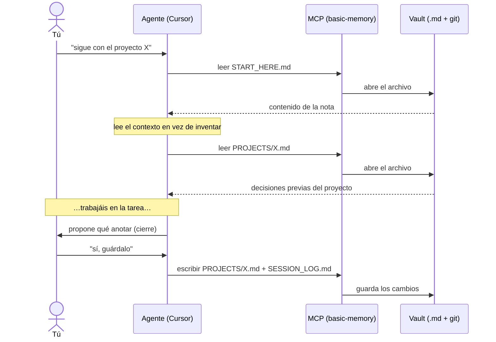

> 🇪🇸 Español · [🇬🇧 English](../en/how-it-works.md)

# Cómo funciona (explicación sencilla y visual)

Esta página **no asume** que sepas qué es un "MCP" ni una "base de datos". Si solo quieres
instalar, salta a la [guía de instalación](instalacion.md). Si quieres **entender** la idea
antes de tocar nada, sigue aquí: en 5 minutos verás el sistema completo.

---

## El problema en una frase

> Los chats con la IA **empiezan en blanco cada vez**. Lo que acordaste ayer no existe hoy,
> salvo que lo lleves pegado en el prompt.

Este kit le da a la IA una **libreta** que sobrevive entre sesiones. Esa libreta son
**archivos de texto** (Markdown) en **tu** ordenador, en una carpeta que tú controlas. Puedes
leerlos, editarlos, buscarlos y versionarlos con **git**, como cualquier otro proyecto.

La memoria **no vive dentro del modelo de IA**. Vive en tus archivos. Eso la hace auditable,
portable y privada.

---

## El recorrido completo (de un vistazo)


Léelo de izquierda a derecha:

1. **Tú + el agente** (Cursor, Claude Code…) escribís en el chat de siempre.
2. El agente habla con el **MCP**, que es un **puente**: traduce "quiero leer/guardar una nota"
   en operaciones reales sobre archivos.
3. El puente lee y escribe en **tu vault**: una carpeta con archivos `.md` bajo **git**.
4. Abajo, un **daemon** opcional vigila el vault y lo **sincroniza** con un remoto (GitHub
   privado) para tener copia de seguridad y usarlo desde otra máquina.

Todo ocurre **en local**. No hay servidor de terceros en medio.

---

## Las tres piezas (y por qué hacen falta las tres)

```text
   ┌─────────────┐      ┌──────────────┐      ┌──────────────────────┐
   │  1. VAULT   │      │   2. MCP     │      │   3. USER RULES      │
   │  carpeta de │ <==> │  el puente   │ <==  │  el "modo de uso"    │
   │  notas .md  │      │ (lee/escribe)│      │  (solo en Cursor)    │
   └─────────────┘      └──────────────┘      └──────────────────────┘
     QUÉ se guarda         CÓMO se accede        CUÁNDO usarlo
```

### 1. El vault — la carpeta de notas (Markdown + git)

Es una carpeta normal con archivos como:

| Archivo              | Para qué sirve                                                                      |
| -------------------- | ----------------------------------------------------------------------------------- |
| `START_HERE.md`      | Índice corto: "por dónde empezar". Lo primero que lee el agente.                    |
| `MEMORY.md`          | Lo que quieres que recuerde **en general** (preferencias, lecciones transversales). |
| `PROJECTS/<algo>.md` | Contexto de **un proyecto concreto** (nombre parecido a tu carpeta de trabajo).     |
| `SESSION_LOG.md`     | Línea de tiempo breve: "qué pasó hoy" (decisiones, cierres).                        |

**¿Por qué git?** Porque te da historial (`git log`), comparar versiones y un remoto privado
para backup u otro PC. **Ojo:** el repo público que estás leyendo **no es tu vault**. Tu vault
es **tuyo** y normalmente **privado**.

### 2. El MCP — el puente entre el editor y la carpeta

**MCP** ("Model Context Protocol") es el mecanismo por el que tu editor lanza un programita y
le pide operaciones: _leer nota_, _escribir nota_, _buscar_. El servidor por defecto se llama
**`basic-memory`**. La variable **`BASIC_MEMORY_HOME`** le dice **qué carpeta** es el vault —
sin eso, la IA no sabe a dónde apuntar.

> ⚠️ El MCP **no "piensa"**. Solo abre, guarda y busca archivos. El modelo sigue decidiendo qué
> pedir; las User Rules ayudan a que no se salte pasos.

### 3. Las User Rules — el "modo de uso" (solo en Cursor)

Son un texto que pegas en la configuración de Cursor. **No** sustituyen al MCP (sin MCP, las
reglas no pueden leer el disco). Sirven para dos cosas:

1. **Ritmo de lectura:** "empieza por `START_HERE`, luego `MEMORY`, luego el proyecto actual".
2. **Higiene:** "no guardes secretos", "anota los cierres en `SESSION_LOG`".

El bloque listo para copiar está en la [guía de instalación](instalacion.md#paso-4--pegar-las-user-rules-en-cursor).

---

## Qué pasa cuando chateas (el flujo, paso a paso)



Nada de esto "sube tus notas para siempre" a un servidor del proveedor de la IA. Lo que
persiste es **lo que se escribe en tus archivos** y lo que tú subas a **tu** remoto si lo
configuras.

---

## Opcional: buscar por palabras **y** por significado

`basic-memory` ya busca. Si tu vault es **grande**, un índice local acelera y afina la
búsqueda. Eso es el paquete **`obsidian-memory-rag`**, expuesto en el IDE por el **MCP híbrido**
con dos herramientas:

| Herramienta           | Qué hace                                                                                                                                                                                                                                   |
| --------------------- | ------------------------------------------------------------------------------------------------------------------------------------------------------------------------------------------------------------------------------------------ |
| `vault_fts_search`    | Búsqueda **léxica** (SQLite FTS5 / BM25): rápida y exacta por palabras clave.                                                                                                                                                              |
| `vault_hybrid_search` | Búsqueda **híbrida**: mezcla lo léxico con lo **semántico** (por significado). "El daemon que sincroniza git" encuentra la nota aunque no uses esas palabras exactas — y devuelve **solo la sección relevante**, lo que **ahorra tokens**. |

No es obligatorio para empezar. Es una capa de **comodidad, mejor recall y ahorro de tokens**,
no el núcleo. Detalle técnico: [ADR-0017](../adr/0017-hybrid-query-embeddings.md).

---

## Qué **no** es (para no confundirse)

- **No** es la memoria nativa de Cursor (los avisos `memory://…`): eso es del IDE; esto son
  **archivos** del vault vía MCP.
- **No** es "memoria en la nube del modelo": lo que persiste son **tus archivos** y **tu git**.
- **No** reemplaza a Obsidian: puedes usar Obsidian u otro editor; el vault son archivos.
- **No** garantiza obediencia perfecta: las reglas mejoran el comportamiento, pero el modelo
  puede equivocarse — por eso el vault es **revisable por un humano**.

---

## Varias ventanas, un solo vault

Con la config típica (`BASIC_MEMORY_HOME` en tu `mcp.json` de usuario), **todas** las ventanas
de Cursor comparten el **mismo** vault en disco. Está bien: usa `PROJECTS/<repo>.md` para no
mezclar contextos. ¿Necesitas memorias totalmente aisladas? Monta **otro** vault y otra entrada
MCP (avanzado).

---

## Siguiente paso

→ **Instalación ordenada y repetible:** [`instalacion.md`](instalacion.md)
→ **¿Prefieres que lo haga un agente por ti?** [`instalar-con-agente.md`](instalar-con-agente.md)
→ **Dudas y comparación con alternativas:** [`faq.md`](faq.md) · **Glosario:** [`glosario.md`](glosario.md)
