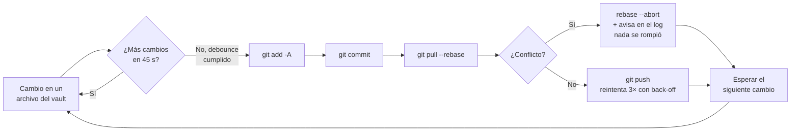

> 🇪🇸 Español · [🇬🇧 English](../en/sync.md)

# Sincronizar el vault con git

El **vault** es la carpeta Markdown donde el agente guarda su memoria (`MEMORY.md`, `PROJECTS/`, `STACKS/`, etc.). Sincronizarlo con **git** (el sistema que versiona los archivos y los sube a un repositorio remoto, p. ej. en GitHub) te da tres cosas:

- **Historial** — cada cambio queda registrado; puedes ver qué se anotó y cuándo, y volver atrás si algo se borró por error.
- **Copia de seguridad** — si el disco falla, tu memoria vive en el remoto.
- **Multi-máquina** — trabajas en el portátil, sigues en la torre; un `git pull` trae lo último.

La pregunta no es _si_ sincronizar, sino _cómo_: a mano, con un programa que lo haga por ti, o aprovechando un repo que ya actualizas. Hay **tres opciones**, y debajo una sección con los detalles finos de Windows.

> → Si aún no has instalado el kit, empieza por la [guía de instalación](instalacion.md). Esta página asume que el vault ya existe y es un repositorio git con un remoto configurado.

## Cómo sincroniza el daemon (de un vistazo)

La Opción A usa un **daemon**: un programa pequeño que corre en segundo plano, vigila la carpeta y sincroniza solo cuando detecta cambios. Su ciclo es así:



Dos ideas clave del diagrama:

- **Debounce** — el daemon **espera** un margen tras el último cambio antes de sincronizar (por defecto **45 segundos**). Así, si guardas diez veces seguidas, hace **una** sincronización al final en vez de diez. Evita machacar el remoto y el disco.
- **Orden de sincronización** — siempre `add → commit → pull --rebase → push`, en ese orden exacto. No es arbitrario: ver [Opción B](#opción-b-la-más-simple-git-a-mano) y el [ADR-0004](../adr/0004-sync-order-add-commit-pull-push.md).

---

## Resumen de las tres opciones

| Opción                                  | Esfuerzo         | Automático          | Cuándo elegirla                                                   |
| --------------------------------------- | ---------------- | ------------------- | ----------------------------------------------------------------- |
| **A — daemon `obsidian-memoryd watch`** | Compilar una vez | Sí, al guardar      | Quieres "configúralo y olvídate"; el vault es una carpeta aparte. |
| **B — git a mano**                      | Cero setup       | No, tú decides      | Prefieres control total y no te importa teclear unos comandos.    |
| **C — memoria en el mismo repo**        | Cero extra       | Con tu flujo normal | Ya versionas un proyecto y quieres meter la memoria dentro.       |

---

## Opción A (recomendada): el daemon `obsidian-memoryd watch`

`obsidian-memoryd` es el **daemon** (programa en segundo plano) que incluye el kit. Vigila la carpeta del vault y, cuando detecta un cambio, espera el debounce y hace la sincronización completa por ti. Su código está en [`../../cmd/obsidian-memoryd/`](../../cmd/obsidian-memoryd/).

### Compilarlo

Necesitas [Go](https://go.dev) instalado. En Windows, compílalo como **aplicación de subsistema GUI** con la opción `-H windowsgui`, que hace que el `.exe` **no abra ninguna ventana de consola** (ni la suya ni la de los `git` que lanza por dentro):

```bash
go build -ldflags="-H windowsgui" -o bin/obsidian-memoryd.exe ./cmd/obsidian-memoryd
```

> ✅ En Linux y macOS no necesitas `-ldflags`; `go build -o bin/obsidian-memoryd ./cmd/obsidian-memoryd` basta. El silenciado de consola es específico de Windows.

El kit ya trae dos archivos que garantizan cero consolas en Windows aunque el `.exe` sea de subsistema GUI: `proc_windows.go` lanza cada subproceso `git` con las marcas `CREATE_NO_WINDOW + HideWindow: true`; `proc_other.go` es un no-op en Linux/macOS. No tienes que tocarlos.

### Arrancarlo

El daemon toma como vault, por orden de preferencia: la variable de entorno `BASIC_MEMORY_HOME`, luego `OBSIDIAN_MEMORY_VAULT`, y si ninguna está, **la carpeta desde la que se ejecuta** (su directorio de trabajo). También puedes pasarlo explícito con `--vault`:

```bash
obsidian-memoryd watch --vault "C:\RUTA\ABSOLUTA\AL\VAULT"
```

Para que arranque silencioso al iniciar sesión en Windows, lo más limpio es un **acceso directo en la carpeta Inicio**:

- **Destino**: el `.exe` compilado.
- **Argumentos**: `watch`.
- **Iniciar en**: la raíz del vault (así el daemon usa esa carpeta aunque no definas `BASIC_MEMORY_HOME`).

> ⚠️ **No** envuelvas el acceso directo en `cmd.exe` ni en `powershell.exe`: eso reintroduce el parpadeo de consola que `-H windowsgui` te quitó.

### Ajustar la frecuencia

El debounce por defecto son **45 segundos**. Cámbialo con la variable `OBSIDIAN_MEMORY_DEBOUNCE`, que acepta una duración estilo Go (`30s`, `2m`, `5m`). Los límites son **mínimo 5 s** y **máximo 15 m**; un valor fuera de rango o ilegible se ignora y vuelve a los 45 s por defecto.

```powershell
setx OBSIDIAN_MEMORY_DEBOUNCE 2m
```

Subir el debounce (p. ej. `2m` o `5m`) es útil si no quieres microcommits constantes o si juegas y prefieres menos picos de disco (ver [Windows: detalles](#sincronizar-sin-tirones-mientras-juegas)).

### Qué hace en cada sincronización

El daemon ejecuta el orden seguro `add → commit → pull --rebase → push`, con protecciones que no tendrías a mano:

- Un **commit vacío** (nada que guardar) se detecta y se omite, no es un error.
- Si `pull --rebase` encuentra un **conflicto**, hace `rebase --abort` automáticamente y te avisa en el log para que lo resuelvas tú; nunca deja el repo a medias ni fuerza nada.
- El `push` **reintenta hasta 3 veces** con espera creciente, por si el remoto rebota un instante.
- Lanza `git` con `GIT_TERMINAL_PROMPT=0`, así que si faltan credenciales falla rápido en vez de quedarse colgado esperando una contraseña que nadie va a teclear.

### Comprobar salud: `doctor`

Como el daemon corre oculto, necesitas una forma de preguntarle "¿sigues vivo y empujando?". Eso es `doctor`:

```bash
obsidian-memoryd doctor
```

Te muestra el **latido** (heartbeat: el daemon lo refresca cada 60 s; si lleva más de **5 minutos** sin latir, probablemente está caído), el último `push` con éxito, cuántos commits tienes sin subir, abortos de rebase recientes y fallos de push consecutivos. Si algo va mal, marca **ALARM** y te apunta a `obsidian-memoryd inspect --last 30` para ver el detalle del log.

> → Regla rápida: si `doctor` dice que el último push fue hace **más de un día**, el daemon casi seguro está parado o el remoto está rechazando. Revísalo.

### Otros subcomandos útiles

```bash
obsidian-memoryd sync once                    # fuerza UNA sincronización ahora y sale
obsidian-memoryd inspect --last 30            # últimas N líneas del log
obsidian-memoryd service install --user       # instálalo como servicio del sistema
obsidian-memoryd service start  --user        # (alternativa al acceso directo de Inicio)
obsidian-memoryd service stop   --user
obsidian-memoryd service status --user
```

---

## Opción B (la más simple): git a mano

Cero configuración, cero programas en segundo plano: tú decides cuándo converger con el remoto. Abre una terminal **en la carpeta del vault** y ejecuta:

```bash
git status
git add -A
git commit -m "memory"   # solo si hay cambios
git pull --rebase
git push
```

El orden importa y es siempre el mismo: **`add → commit` (si hay algo) `→ pull --rebase → push`** ([ADR-0004](../adr/0004-sync-order-add-commit-pull-push.md)). La razón:

- Si haces `git pull --rebase` con cambios **sin preparar** (sin `add`), Git se niega: _cannot pull with rebase: You have unstaged changes_. Por eso `add` (y `commit`) van **antes** del pull.
- Si haces `push` **antes** de `pull`, Git lo rechaza cuando otra máquina ya subió algo. Por eso el pull va **antes** del push.

Este orden funciona haya o no cambios locales, y se recupera limpio cuando el remoto se ha adelantado. (Es exactamente lo que automatiza la Opción A.)

---

## Opción C (alternativa): la memoria dentro del mismo repo git que ya usas

Si ya tienes un **repositorio git que actualizas con tu flujo normal** (tu proyecto, tu fork, tu setup personal), puedes meter la memoria del agente **dentro de ese mismo repo**. Así un único `git pull` / `git push` mantiene alineados **código + docs + memoria**, sin un segundo temporizador ni daemon cuyo único trabajo sea "refrescar memoria".

**Cómo:**

1. Usa un **clon git privado** (no subas secretos a un repo público).
2. En el cliente (Cursor, Claude Code…), apunta `BASIC_MEMORY_HOME` a una ruta **absoluta dentro de ese clon**, p. ej. `D:\trabajo\mi-setup\memory`, o la raíz del repo si las notas viven ahí.
3. Abre esa carpeta como raíz del workspace para que apliquen sus ajustes `.vscode` (ver [Windows: detalles](#evitar-ventanas-de-consola-que-parpadean)).

**Layout sugerido (repo privado):**

```text
mi-memoria-agente/
  memory/                 # BASIC_MEMORY_HOME = esta carpeta
    .obsidian/            # opcional (Obsidian); basic-memory no lo exige
    START_HERE.md
    MEMORY.md
    SESSION_LOG.md
    PROJECTS/
  README.md               # cómo abrir el proyecto en tu cliente
```

| Qué quieres actualizar                    | Cómo, sin automatismos locales extra                                  |
| ----------------------------------------- | --------------------------------------------------------------------- |
| Plantillas y docs del **kit público**     | `git pull` del upstream en tu fork/clon; merge o rebase como siempre. |
| **Tus** notas (`MEMORY.md`, `PROJECTS/`…) | Mismo repo: commit + push al cerrar; en otro equipo, `git pull`.      |

> ⚠️ **Límite honesto:** "auto-sync en segundo plano sin ningún actor" no existe. O **tú** haces `git pull`/`push`, o añades **CI en la nube** (p. ej. GitHub Actions en _tu_ repo) — que no es una tarea en tu PC, pero sí automatización en servidor. Esta opción asume **solo git en tu máquina**.

---

## Windows: detalles

Esta sección recoge lo específico de Windows. Si usas Linux o macOS, puedes saltártela.

### Evitar ventanas de consola que parpadean

En Windows, ciertos procesos abren una ventana negra de consola que parpadea y roba el foco. Las causas habituales son **el IDE** (Git y extensiones), **los servidores MCP** (`node`, `uvx`, `npx`) y **tareas programadas** que lanzan `powershell.exe` o `cmd.exe`. Para acercarte a "cero parpadeos" en el uso normal del vault:

- **Abre siempre la carpeta correcta.** Los ajustes del repo viven en **`.vscode/settings.json`** y solo aplican si abres el **directorio raíz** del repo o del vault (**File → Open Folder**), no un archivo suelto. Tras actualizar el repo, ejecuta **Developer: Reload Window** una vez.
- **Ajustes ya incluidos.** Los ajustes SCM viven en el `.vscode/settings.json` de la raíz del repo y el inicializador escribe los mismos valores por defecto en `<vault>/.vscode/settings.json`. Desactivan el sondeo agresivo de Git, parte de la decoración SCM, y excluyen del watcher rutas ruidosas (`.obsidian/`, cachés de build). También ponen `git.terminalAuthentication: false` para no forzar consola al autenticar.
- **Si ves ventanas con título `…\Git\bin\git.exe` o `bin\sh.exe`**, fija en tu JSON (User o workspace) la ruta al git "limpio":

  ```json
  { "git.path": "C:\\Program Files\\Git\\cmd\\git.exe" }
  ```

  Fíjate: es el de `cmd\git.exe`, **no** el de `bin\`. En Windows, el inicializador del kit intenta escribir este `git.path` al fusionar el vault si esa ruta existe.

- **Si quieres el panel Git en tiempo real** en una carpeta concreta, edita **tu copia** de `.vscode/settings.json` y vuelve a poner `git.autorefresh` en `true` (a cambio de aceptar más procesos `git`/`conhost`).
- **MCP y extensiones.** Cada servidor MCP con `command` (`uvx`, `node`, `npx`) puede levantar consola; reduce los MCP activos en **Settings → MCP** y desactiva extensiones que ejecuten Git o shells en bucle (prueba sin GitLens). Para diagnosticar, abre el **Administrador de tareas → Detalles** (columna línea de comando) mientras reproduces el parpadeo.

> ⚠️ **Límite honesto:** no existe un interruptor en Markdown que garantice cero ventanas en **todas** las combinaciones de extensiones, MCP y tareas del sistema. El kit aplica workspace + guías para acercarse a "cero flashes" en el uso normal. Recuerda que la Opción A, compilada con `-H windowsgui`, **sí** garantiza cero consola para el propio daemon.

### Sincronizar sin tirones mientras juegas

Si juegas a pantalla completa, no quieres picos de disco/Git ni consolas que te quiten el foco. El principio es **separar "cuándo sincronizo" de "cuándo juego"**:

- **Sube el debounce o desactiva la sincronización** durante la partida. Con la Opción A, `setx OBSIDIAN_MEMORY_DEBOUNCE 5m` reduce la frecuencia; o cierra el daemon mientras juegas. Con git a mano (Opción B) ya controlas el momento por definición.
- **Evita dos automatismos** distintos que hagan `git` al mismo ritmo: redundancia = más I/O. Un solo canal (daemon **o** git manual) basta.
- **Cierra el IDE.** Cursor/VS Code con el vault abierto en la misma sesión que un juego competitivo **sigue siendo pesado** (Git, extensiones, MCP). Lo más limpio: **cerrar el IDE** al jugar, o no abrir la carpeta del vault hasta terminar.
- **Si ves `conhost`/consola al jugar**, suele venir del IDE, sus extensiones, el Git del IDE u otra app (launcher, overlay, antivirus). Identifícalo con **Administrador de tareas → Detalles** (línea de comando) mientras ocurre.

| Situación                            | Qué hacer                                                                       |
| ------------------------------------ | ------------------------------------------------------------------------------- |
| Memoria al día sin molestar al juego | Debounce largo, o desactivar el daemon antes de jugar y reactivarlo después.    |
| Menos lag con el IDE abierto         | `.vscode` del vault + menos MCP/extensiones; idealmente **sin** IDE en partida. |
| Sin parpadeos de consola             | IDE con ajustes Git calmados; un único canal de sync.                           |

Si usaste el **Programador de tareas** de Windows para algo propio, puedes pausarlo y reactivarlo (ajusta los nombres a los tuyos):

```powershell
# Pausar antes de jugar
Get-ScheduledTask -TaskName 'CursorMemoryVaultSync' -ErrorAction SilentlyContinue |
  Disable-ScheduledTask

# Reactivar después
Get-ScheduledTask -TaskName 'CursorMemoryVaultSync' -ErrorAction SilentlyContinue |
  Enable-ScheduledTask
```

### (Opcional avanzado) `basic-memory` por HTTP "siempre activo"

Esto es independiente de la sincronización git: trata de cómo el cliente **lee** la memoria, no de cómo se versiona. Por defecto, `basic-memory` (el servidor MCP que sirve el vault) arranca **por stdio**: el cliente lo lanza con `uvx` cuando hace falta y no necesitas ningún proceso aparte ni preocuparte por puertos. **Es la opción recomendada.**

Si en cambio quieres un **listener HTTP persistente** (Streamable HTTP) que esté siempre encendido, arráncalo en una terminal (puedes minimizarla):

```powershell
$env:BASIC_MEMORY_HOME = "C:\RUTA\ABSOLUTA\AL\VAULT"
uvx basic-memory mcp --transport streamable-http --host 127.0.0.1 --port 8765 --path /mcp
```

En `mcp.json`, la entrada de `basic-memory` debe usar la **misma** URL y **sin** `command`/`uvx`:

```json
{ "url": "http://127.0.0.1:8765/mcp" }
```

El puerto por defecto del kit es **8765**, elegido para evitar choques con los puertos habituales de desarrollo (**8000**, **8080**, **3000**) — ver [ADR-0016](../adr/0016-localhost-mcp-default-port.md). Si **8765** ya está ocupado, elige otro libre (p. ej. **8877**) y usa **exactamente el mismo** en la línea `uvx` y en `mcp.json`. Para comprobar que el listener está vivo:

```powershell
Test-NetConnection 127.0.0.1 -Port 8765
```

Luego, en el cliente: **Settings → MCP** debe mostrar `basic-memory` en verde. Tras editar `mcp.json`, **reinicia el cliente** o ejecuta **Developer: Reload Window**.

> ⚠️ **No** expongas este listener a la red sin TLS y autenticación. Está pensado para `127.0.0.1` (tu propia máquina) y nada más. Para volver a stdio: detén el proceso que ocupa el puerto (`Get-NetTCPConnection` / Administrador de tareas) y restaura el bloque stdio en `mcp.json`.

---

## Mantenimiento del vault (mantenerlo barato de leer)

Con el tiempo el vault crece y leer notas enteras se vuelve caro — sobre todo si lanzas varios
agentes (cada lectura completa se multiplica × N). Tres herramientas lo mantienen sano (parte de
[ADR-0018](../adr/0018-multi-agent-token-efficiency.md)):

| Comando / tool                                               | Qué hace                                                                                                                                                                  |
| ------------------------------------------------------------ | ------------------------------------------------------------------------------------------------------------------------------------------------------------------------- |
| `obsidian-memory-rag audit --vault "<VAULT>"`                | Lista notas sobre el presupuesto de tokens (~8k), `[[wikilinks]]` rotos y el tamaño de `SESSION_LOG.md`. También como tool MCP **`vault_audit`**.                         |
| `obsidian-memory-rag rotate-log --vault "<VAULT>" --keep 12` | Archiva las secciones viejas de `SESSION_LOG.md` a `SESSION_LOG/archive.md`, dejando las 12 recientes. No-destructivo.                                                    |
| **`vault_hybrid_search`** (hábito de búsqueda, tool MCP)     | La palanca diaria: devuelve la **sección relevante** en vez de la nota entera, así las lecturas siguen baratas según crece el vault. Úsala antes de una lectura completa. |

> **Regla de oro del ahorro:** que el agente busque con `vault_hybrid_search` (devuelve **solo la
> sección** relevante) en vez de leer notas enteras, y que las notas grandes (historial, logs)
> vivan como **archivos** que se leen a demanda. Detalle en la [guía de instalación, User Rules](instalacion.md#paso-4--pegar-las-user-rules-en-cursor).
